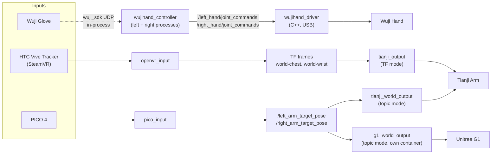

# Architecture

How data flows from input device to robot hardware, which process does what,
and the conventions that keep input and output packages interchangeable.

Audience: a developer working on the code. Operator setup lives in the
[guides index](README.md); daily commands in [usage.md](usage.md). For the
PICO coordinate-transform and incremental-control math, read
[pico_input/ARCHITECTURE.md](../src/input_devices/pico_input/ARCHITECTURE.md);
that is the reference for any coordinate-frame bug on the PICO path.

- [Data flow](#data-flow): the full pipeline in one diagram.
- [Input devices](#input-devices): how each device becomes a standard interface.
- [Hand controller](#hand-controller): the two-process retargeting + IK core.
- [Output devices](#output-devices): the four controllers and what each consumes.
- [Camera](#camera): head stereo + wrist RealSense pipeline.
- [Bringup and Monitor](#bringup-and-monitor): launch files and the GUI.
- [Process and container model](#process-and-container-model): what runs where, and why G1 is separate.
- [Configuration convention](#configuration-convention): the `.yaml.template` seeding scheme.
- [Invariants](#invariants): rules that must hold across changes.

## Data flow

Every path follows the same shape: **input device, standardized topic/TF
interface, output controller, hardware**. Inputs and outputs only meet at the
standard interface, which is what makes them swappable.

The dashed edge is not a ROS2 topic: the glove SDK is imported in-process by
each hand controller, so glove data never crosses a topic hop.

## Input devices

All under `src/input_devices/`. Each turns hardware into one of the standard
interfaces:

| Package | Device | Interface it produces |
|---|---|---|
| `wuji_glove/` | Wuji Glove (default hand input) | None. Connects in-process via `wuji_sdk` UDP directly inside each hand controller |
| `openvr_input/` | HTC Vive Tracker (SteamVR) | TF: `world -> chest`, `world -> wrist` |
| `pico_input/` | PICO 4 arm/hand tracking | `PoseStamped` on `/left_arm_target_pose`, `/right_arm_target_pose`. These are chest-frame poses; the node converts from PICO's world frame internally |
| `manus_input/` | MANUS Glove | Community-supported and feature-frozen; not surfaced in the Monitor GUI |

The topic contract for plugging in a custom input is specified in
[Custom Input Device](../README.md#custom-input-device).

## Hand controller

`src/controller/` provides `wujihand_controller`, which runs as **two
independent processes** (`wujihand_controller_left`, `wujihand_controller_right`).
Each has its own GIL and runs its own retargeting + IK, so the sides never
block each other.

Key properties:

- **Input selection**: `wujihand_ik.yaml::input_source` picks which input
  device feeds it. Dispatch logic, and the reference integration pattern for a
  custom hand input, live in
  `src/output_devices/wujihand_output/wujihand_controller.py`.
- **Never touches hand hardware**: it always publishes
  `/left_hand/joint_commands` and `/right_hand/joint_commands`
  (`sensor_msgs/JointState`, ~120 Hz) regardless of whether a physical hand is
  attached. Only the separate `wujihand_driver` process (from the
  `wujihandros2` submodule, C++) opens the real USB connection.
- **Sim mode**: `wuji_teleop_hand.launch.py enable_hand_driver:=false` skips
  the driver process (real glove input, no physical hand). Pair with
  `g1_world_output/scripts/mujoco_visualizer.py --focus hands`.

## Output devices

All under `src/output_devices/`:

| Package | Hardware | Consumes |
|---|---|---|
| `wujihand_output/` | Wuji Hand | Hand IK controller config + retargeting parameters (see [Hand controller](#hand-controller)) |
| `tianji_output/` | Tianji Arm | TF mode: `openvr_input`'s TF frames. Used by the HTC path |
| `tianji_world_output/` | Tianji Arm | Topic mode: `/left_arm_target_pose`, `/right_arm_target_pose`. Used by the PICO path. Its `transform_utils.py` has the chest-frame transform utilities a custom input would need |
| `g1_world_output/` | Unitree G1 (dual arm) | The **same** topic contract as `tianji_world_output`, so it is a drop-in output alternative, not a new input path. Does its own chest-to-pelvis remap (`transform_utils.py::chest_pose_to_pelvis`) |

`g1_world_output` solves IK with Pinocchio + CasADi and talks to the robot
over `unitree_sdk2py` DDS. Its `--dry-run` flag (or `dry_run:=true` on the
launch file) is the hardware/sim toggle: real IK, no DDS connection. URDF,
MJCF, and meshes live in `src/g1_wuji2_description/`. Full details, including
the sim/hardware toggle and the MuJoCo scripts, are in the
[package README](../src/output_devices/g1_world_output/README.md).

## Camera

`src/camera/` runs the unified camera pipeline: a stereo head camera (USB UVC,
`/dev/stereo_camera` udev symlink) plus dual RealSense D405 wrist cameras. The
head camera splits into `/stereo/{left,right}/compressed` for ROS2 and
separately H.264-encodes (NVENC when available, else libx264) for PICO
streaming. Topic map and camera troubleshooting:
[wuji-camera-topics.md](wuji-camera-topics.md).

## Bringup and Monitor

- `src/wuji_teleop_bringup/` holds the launch files that wire packages
  together per preset: `wuji_teleop_hand.launch.py` (hand-only),
  `wuji_teleop.launch.py` (HTC arm path), `pico_teleop.launch.py` (PICO arm
  path, its own file because it uses a different arm controller).
- `src/wuji_teleop_monitor/` is the Qt5 GUI with three entry points:
  `monitor`, `brake`, `camera`. `monitor` is the primary one-click flow and is
  the reference for how presets map to launch files and flags.

## Process and container model

Two containers, one ROS2 graph (host networking, same `ROS_DOMAIN_ID`):

- **`teleop`** (`wuji-hand-teleop`): everything except the G1 controller. The
  host `src/` bind-mounts in as the colcon workspace source.
- **`g1_world_output`** (`g1-world-output`): the G1 controller only. It is a
  separate image because Pinocchio with working CasADi Python bindings only
  ships via a `robotpkg` apt build linked against NumPy 1.x, which conflicts
  with the NumPy 2.x the rest of the stack needs. The two sides talk purely
  over ROS2/DDS.

Within `teleop`, the hand pipeline is per-side processes end to end: two
controller processes, plus the driver process that owns USB.

## Configuration convention

Config files are tracked in git as `.yaml.template` only. On first container
start, `docker/entrypoint.sh` seeds each missing real `.yaml` from its
template sibling. The real files are gitignored, so serials and IPs never land
in the repo and `git pull` never conflicts with local values. After adding a
new template, rerun `colcon build --symlink-install` so the `install/share/`
symlink picks it up. The full config list is in
[Configuration Files Summary](../README.md#configuration-files-summary).

## Invariants

- **Single Tianji TCP session**: the controller cabinet accepts one client.
  `brake` and `monitor` teleop must never run concurrently.
- **Controller/driver split**: only `wujihand_driver` opens the hand USB
  connection. The hand controller stays hardware-agnostic and always publishes
  joint-command topics.
- **Vendored code is pinned**: `src/input_devices/pico_input/vendor/` is
  upstream XRoboToolkit source under its own licenses. Treat it as an external
  dependency; do not modify it as first-party code.
