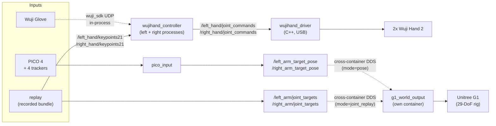
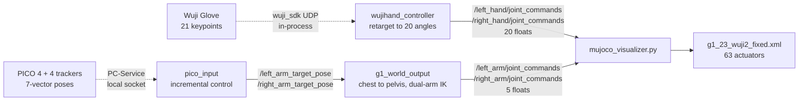
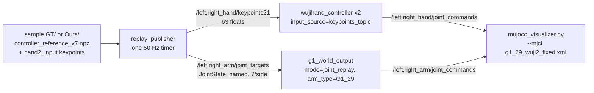
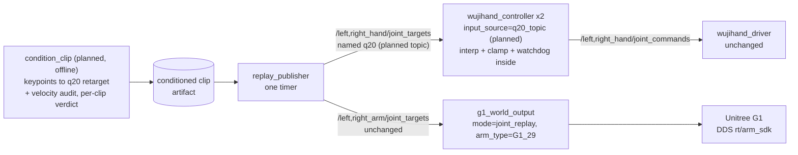

# Architecture

How data flows from input device to robot hardware, which process does what,
and the conventions that keep input and output packages interchangeable.

Audience: a developer working on the code. Operator setup lives in the
[guides index](README.md); daily commands in [usage.md](usage.md). For the
PICO coordinate-transform and incremental-control math, read
[pico_input/ARCHITECTURE.md](../src/input_devices/pico_input/ARCHITECTURE.md);
that is the reference for any coordinate-frame bug on the PICO path.

- [Data flow](#data-flow): the full pipeline in one diagram.
- [Hardware to sim data flow](#hardware-to-sim-data-flow): every hop from device to MuJoCo, with the file and line that performs it.
- [SOT bundle replay](#sot-bundle-replay): replaying recorded motion through the same pipeline.
- [Input devices](#input-devices): how each device becomes a standard interface.
- [Hand controller](#hand-controller): the two-process retargeting + IK core.
- [Output devices](#output-devices): the four controllers and what each consumes.
- [Camera](#camera): head stereo + wrist RealSense pipeline.
- [Bringup and Monitor](#bringup-and-monitor): launch files and the GUI.
- [Process and container model](#process-and-container-model): what runs where, and why G1 is separate.
- [Configuration convention](#configuration-convention): the `.yaml.template` seeding scheme.
- [Invariants](#invariants): rules that must hold across changes.

## Data flow

Every path follows the same shape: **input device, standardized topic/TF
interface, output controller, hardware**. Inputs and outputs only meet at the
standard interface, which is what makes them swappable.



The dashed edges are the ones that are not a plain ROS2 topic hop inside
one process tree. The glove SDK is imported in-process by each hand
controller, so glove data never crosses a topic. The arm targets (poses in
`mode=pose`, named joint angles in `mode=joint_replay` — the `mode` ROS
parameter on `g1_world_output_node` selects which topic set it listens to)
do cross a topic, but between *containers*: `g1_world_output` runs in its
own image, so nothing in the `teleop` container can start it. See
[Process and container model](#process-and-container-model).

That diagram stops at hardware. For the sim path, and for the file and line
behind every hop in either diagram, see
[Hardware to sim data flow](#hardware-to-sim-data-flow).

## Hardware to sim data flow

Every hop from a physical device to a MuJoCo actuator, with the file and line
that performs it. The point is checkability: any claim about this pipeline
should be verifiable against code without searching for it first.

<details id="Trackers">

<summary><strong>4 PICO Motion Trackers</strong> — first-time host setup and image build</summary>

**The "4 trackers"** are **PICO Motion Trackers**, part of the PICO 4 kit,
not a separate tracking system. Two are worn on the wrists and drive
end-effector pose. Two are worn on the outer upper arms and drive the
elbow-direction hint, which the G1 IK currently ignores (see
[Arm chain](#arm-chain-pico-to-mujoco), step 9). HTC Vive Trackers were the
upstream alternative and their code is gone; see [cleanup.md](deprecated/cleanup.md).

</details>

The two chains never meet. No file in `pico_input` or `g1_world_output`
references the glove or the hand topics, and no file in `controller` or
`wujihand_output` references the arm topics. Either chain runs alone, and the
viewer moves whatever is being published.



### Hand chain: glove to MuJoCo

Runs as two independent processes, one per side. No ROS2 topic on the way in.

| # | Hop | Code |
|---|---|---|
| 1 | Glove SDK stream opened in-process (`hand_skeleton().subscribe()`) | [wujihand_node.py:207](../src/controller/controller/wujihand_node.py#L207) |
| 2 | Control timer fires at 120 Hz | [wujihand_node.py:130](../src/controller/controller/wujihand_node.py#L130), default at [:33](../src/controller/controller/wujihand_node.py#L33) |
| 3 | One skeleton frame pulled, then the queue is drained to the newest | [wujihand_node.py:226](../src/controller/controller/wujihand_node.py#L226), [:243](../src/controller/controller/wujihand_node.py#L243) |
| 4 | 21 joint positions become a `(21, 3)` float32 array. Any other count drops the frame | [wujihand_node.py:45](../src/controller/controller/wujihand_node.py#L45) |
| 5 | Keypoints handed to the controller object | [wujihand_node.py:251](../src/controller/controller/wujihand_node.py#L251) |
| 6 | `wuji_retargeting` maps 21 keypoints to 20 joint angles | [wujihand_controller.py:187](../src/output_devices/wujihand_output/wujihand_output/wujihand_controller.py#L187) |
| 7 | **Publish** `/{side}_hand/joint_commands`, `JointState`, 20 positions, `name` deliberately unset | [hand_interface.py:78](../src/output_devices/wujihand_output/wujihand_output/_internal/hand_interface.py#L78) (publisher), [:152](../src/output_devices/wujihand_output/wujihand_output/_internal/hand_interface.py#L152) (publish) |
| 8 | **Subscribe** in the viewer | [mujoco_visualizer.py:68](../src/output_devices/g1_world_output/scripts/mujoco_visualizer.py#L68) |
| 9 | Written to the 20 hand actuators | [_mujoco_common.py:186](../src/output_devices/g1_world_output/scripts/_mujoco_common.py#L186) |

Steps 1–3 are the `wuji_glove` input source. With
`input_source: "keypoints_topic"` (SOT bundle replay), steps 1–3 are replaced
by a plain topic subscription — `/{hand_name}/keypoints21`, 63-float
MediaPipe `(21, 3)` in meters, latest-wins under a lock
([wujihand_node.py:255](../src/controller/controller/wujihand_node.py#L255)
setup, [:264](../src/controller/controller/wujihand_node.py#L264) callback,
[:275](../src/controller/controller/wujihand_node.py#L275) consume) — and
steps 4–9 are identical, so replay exercises the production retargeting path.

Because the message carries no joint names, index order is an unchecked
convention shared across three codebases: the retargeter's output order, the
`wujihandros2` driver's index parsing, and `HAND_CODES` in the viewer.

### Arm chain: PICO to MuJoCo

Crosses a container boundary at step 10. Both containers use host networking,
the same `ROS_DOMAIN_ID`, and `docker/cyclonedds.xml`.

| # | Hop | Code |
|---|---|---|
| 1 | PC-Service reads the headset over WiFi; the pybind SDK exposes HMD and tracker poses as `[x, y, z, qx, qy, qz, qw]` | [xrobotoolkit_client.py:93](../src/input_devices/pico_input/pico_input/xrobotoolkit_client.py#L93), [:132](../src/input_devices/pico_input/pico_input/xrobotoolkit_client.py#L132) |
| 2 | Wrapped as `HeadsetData` / `TrackerData` behind the `DataSource` ABC | [live_data_source.py:77](../src/input_devices/pico_input/pico_input/data_source/live_data_source.py#L77), [:109](../src/input_devices/pico_input/pico_input/data_source/live_data_source.py#L109) |
| 3 | Publish timer fires at 90 Hz | [pico_input_node.py:322](../src/input_devices/pico_input/pico_input/pico_input_node.py#L322), default at [:126](../src/input_devices/pico_input/pico_input/pico_input_node.py#L126) |
| 4 | Main loop reads the source, then auto-initializes after `auto_init_delay` | [pico_input_node.py:505](../src/input_devices/pico_input/pico_input/pico_input_node.py#L505), [:427](../src/input_devices/pico_input/pico_input/pico_input_node.py#L427) |
| 5 | Tracker serial resolved to a body role | [pico_input_node.py:490](../src/input_devices/pico_input/pico_input/pico_input_node.py#L490) |
| 6 | OpenXR to robot frame, delta from the init snapshot, One-Euro smoothing | [incremental_controller.py:185](../src/input_devices/pico_input/pico_input/incremental_controller.py#L185) |
| 7 | TF broadcast `world_{side}` to `pico_{side}_{wrist,arm}` | [pico_input_node.py:652](../src/input_devices/pico_input/pico_input/pico_input_node.py#L652) |
| 8 | **Publish** `/{side}_arm_target_pose`, `PoseStamped`, chest frame | [pico_input_node.py:264](../src/input_devices/pico_input/pico_input/pico_input_node.py#L264) (publisher), [:640](../src/input_devices/pico_input/pico_input/pico_input_node.py#L640) (call), [:667](../src/input_devices/pico_input/pico_input/pico_input_node.py#L667) (helper) |
| 9 | **Publish** `/{side}_arm_elbow_direction`, `Vector3Stamped` | [pico_input_node.py:271](../src/input_devices/pico_input/pico_input/pico_input_node.py#L271) (publisher), [:681](../src/input_devices/pico_input/pico_input/pico_input_node.py#L681) (compute), [:836](../src/input_devices/pico_input/pico_input/pico_input_node.py#L836) (publish) |
| 10 | **Subscribe** in the G1 container | [g1_world_output_node.py:190](../src/output_devices/g1_world_output/g1_world_output/g1_world_output_node.py#L190) (poses), [:196](../src/output_devices/g1_world_output/g1_world_output/g1_world_output_node.py#L196) (elbow) |
| 11 | Control timer fires at 90 Hz | [g1_world_output_node.py:238](../src/output_devices/g1_world_output/g1_world_output/g1_world_output_node.py#L238), default at [:131](../src/output_devices/g1_world_output/g1_world_output/g1_world_output_node.py#L131) |
| 12 | A side with no pose yet is substituted with its `reset_wrist_pose` | [g1_controller.py:172](../src/output_devices/g1_world_output/g1_world_output/g1_controller.py#L172) |
| 13 | Chest frame remapped to pelvis frame | [g1_controller.py:170](../src/output_devices/g1_world_output/g1_world_output/g1_controller.py#L170) |
| 14 | Both arms solved in one IPOPT problem over 10 joints | [robot_arm_ik.py:231](../src/output_devices/g1_world_output/g1_world_output/robot_arm_ik.py#L231), cost at [:203](../src/output_devices/g1_world_output/g1_world_output/robot_arm_ik.py#L203), solve at [:247](../src/output_devices/g1_world_output/g1_world_output/robot_arm_ik.py#L247) |
| 15 | **Publish** `/{side}_arm/joint_commands`, `JointState`, named positions in radians (5/side G1_23, 7/side G1_29 replay) | [g1_world_output_node.py:215](../src/output_devices/g1_world_output/g1_world_output/g1_world_output_node.py#L215) (publisher), [:401](../src/output_devices/g1_world_output/g1_world_output/g1_world_output_node.py#L401) (publish) |
| 16 | Hardware only, skipped under `dry_run`: target buffered, then written to DDS `LowCmd` at 250 Hz. All command paths funnel through one `_send_dual_arm` choke point, and a `flock` on `/tmp/g1_lowcmd_writer.lock` makes a second DDS-writing process fail at startup | [g1_controller.py:93](../src/output_devices/g1_world_output/g1_world_output/g1_controller.py#L93) (choke point), [robot_arm.py:338](../src/output_devices/g1_world_output/g1_world_output/robot_arm.py#L338) (buffer), [:329](../src/output_devices/g1_world_output/g1_world_output/robot_arm.py#L329) (write), [:180](../src/output_devices/g1_world_output/g1_world_output/robot_arm.py#L180) (lock) |
| 17 | **Subscribe** in the viewer | [mujoco_visualizer.py:74](../src/output_devices/g1_world_output/scripts/mujoco_visualizer.py#L74) |
| 18 | Written to the arm actuators, mapped by joint name so 5- and 7-joint commands both work | [_mujoco_common.py:159](../src/output_devices/g1_world_output/scripts/_mujoco_common.py#L159) |

The elbow direction reaches the controller and stops there. It is stored as
`zsp_para` and echoed on `/{side}_arm/zsp_para`, and `robot_arm_ik.py` never
reads it. The two upper-arm trackers therefore have no effect on G1 motion
today.

The IK cost weights position over orientation 100 to 1, and the only hard
constraints are joint limits. An unreachable target is not infeasible: the
solver returns a least-squares compromise and reports success. Nothing
evaluates the residual.

### What the sim writes

The viewer loads `g1_23_wuji2_fixed.xml` by default and drives `data.ctrl`
directly. No IK on the hand side, none in the viewer at all. Pass
`--mjcf .../g1_29_wuji2_fixed.xml` to load the 29-DoF model instead (used for
SOT bundle replay); the hand actuator naming and `stand` keyframe are the
same, and arm commands are applied by joint name, so both models work
unmodified.

| Property | Value | Code |
|---|---|---|
| Model (default) | `g1_23_wuji2_fixed.xml`, 63 actuators (12 leg, 1 waist, 10 arm, 40 hand); `g1_29_wuji2_fixed.xml` has 69 (12 leg, 3 waist, 14 arm, 40 hand) | [_mujoco_common.py:82](../src/output_devices/g1_world_output/scripts/_mujoco_common.py#L82) |
| Hand actuator names | `{side}_wuji_{l,r}_{CODE}` over the 20 `HAND_CODES` | [_mujoco_common.py:31](../src/output_devices/g1_world_output/scripts/_mujoco_common.py#L31), [:112](../src/output_devices/g1_world_output/scripts/_mujoco_common.py#L112) |
| Arm actuator names | `{name}_joint` per command joint name (tuple form), or the 5 `ARM_JOINTS_IK` for legacy positional lists | [_mujoco_common.py:159](../src/output_devices/g1_world_output/scripts/_mujoco_common.py#L159), [:42](../src/output_devices/g1_world_output/scripts/_mujoco_common.py#L42) |
| `ctrl` semantics | Position target. MJCF `general` actuators, `biastype="affine"`: arm gain 500 with per-joint damping, hand gain about 0.41 | `g1_23_wuji2_fixed.xml` actuator block |
| Step rate | Model timestep, 2 ms | [_mujoco_common.py:194](../src/output_devices/g1_world_output/scripts/_mujoco_common.py#L194) |

**Sim stiffness is not the robot's stiffness.** The MJCF arm actuators use gain
500 uniformly; the DDS controller uses tiered gains of 300, 140, and 50
([robot_arm.py:195](../src/output_devices/g1_world_output/g1_world_output/robot_arm.py#L195)). The DDS
path also velocity-clips each target
([robot_arm.py:299](../src/output_devices/g1_world_output/g1_world_output/robot_arm.py#L299)) and the
viewer does not. Tracking behaviour in the viewer is not evidence about
tracking behaviour on hardware.

**The unpublished arms do not hold the `stand` keyframe.** `load_model` resets
to the keyframe, which sets `qpos` only; `ctrl` stays all zeros. With position
servos at gain 500, any joint the keyframe puts away from zero is driven to
zero as soon as stepping starts. Measured on the current MJCF: the left elbow
starts at 1.28 rad and reaches 0.006 rad within 0.4 s of sim time. So an arm
with nothing publishing to it settles at the all-zeros pose, not the keyframe
pose. Reproduce with:

```bash
python3 - <<'PY'
import mujoco, numpy as np
m = mujoco.MjModel.from_xml_path("src/g1_wuji2_description/g1_23_wuji2_fixed.xml")
d = mujoco.MjData(m)
mujoco.mj_resetDataKeyframe(m, d, mujoco.mj_name2id(m, mujoco.mjtObj.mjOBJ_KEY, "stand"))
adr = m.jnt_qposadr[mujoco.mj_name2id(m, mujoco.mjtObj.mjOBJ_JOINT, "left_elbow_joint")]
print("keyframe:", d.qpos[adr])
for _ in range(200): mujoco.mj_step(m, d)
print("after 0.4 s:", d.qpos[adr])
PY
```

### Rates

| Stage | Rate | Code |
|---|---|---|
| Glove skeleton to hand joint commands | 120 Hz | [wujihand_node.py:33](../src/controller/controller/wujihand_node.py#L33) |
| PICO trackers to arm target poses | 90 Hz | [pico_input_node.py:126](../src/input_devices/pico_input/pico_input/pico_input_node.py#L126) |
| Target poses to arm joint commands (mode=pose) | 90 Hz | [g1_world_output_node.py:131](../src/output_devices/g1_world_output/g1_world_output/g1_world_output_node.py#L131) |
| Joint targets to arm joint commands (mode=joint_replay, interpolating) | 250 Hz (`control_rate` launch arg) | [g1_world_output_node.py:462](../src/output_devices/g1_world_output/g1_world_output/g1_world_output_node.py#L462) |
| Arm joint commands to DDS `LowCmd` | 250 Hz | [robot_arm.py:204](../src/output_devices/g1_world_output/g1_world_output/robot_arm.py#L204) |
| MuJoCo step | 500 Hz (2 ms timestep) | [_mujoco_common.py:194](../src/output_devices/g1_world_output/scripts/_mujoco_common.py#L194) |

### Where the chain goes quiet

Every entry here fails without an exception. This is the list to check when the
viewer does not move.

| Symptom | Cause | Code |
|---|---|---|
| Hands never move, no error | QoS mismatch. The real hand publisher is `BEST_EFFORT`; a default `RELIABLE` subscriber silently drops every message | [_mujoco_common.py:59](../src/output_devices/g1_world_output/scripts/_mujoco_common.py#L59) |
| Both arms freeze together | IPOPT raised, so `ok` is false and **neither** side's topic is published, even if only one target was bad | [g1_controller.py:191](../src/output_devices/g1_world_output/g1_world_output/g1_controller.py#L191) |
| One arm frozen in sim but moving on hardware | An absent side publishes nothing, yet `ctrl_dual_arm` writes all arm joints over DDS | [g1_controller.py:192](../src/output_devices/g1_world_output/g1_world_output/g1_controller.py#L192) |
| Hand output stalls, glove is connected | Skeleton frame without exactly 21 joints is dropped silently | [wujihand_node.py:52](../src/controller/controller/wujihand_node.py#L52) |
| Replay targets ignored, throttled warning in the log | Message arrived for the inactive mode (a pose in `joint_replay`, or joint targets in `pose`), or a joint-targets message was missing a required joint name | [g1_world_output_node.py:340](../src/output_devices/g1_world_output/g1_world_output/g1_world_output_node.py#L340) |
| Node exits at startup: "already holds the G1 DDS lowcmd writer lock" | A second `G1ArmController` (second `g1_world_output_node` not in dry-run) — stop the other process | [robot_arm.py:180](../src/output_devices/g1_world_output/g1_world_output/robot_arm.py#L180) |
| `pico_input` refuses to start | A tracker serial is empty, a placeholder, or duplicated. All four are required even though two are unused by the IK | [pico_input_node.py:176](../src/input_devices/pico_input/pico_input/pico_input_node.py#L176) |
| PICO node runs but publishes nothing | Incremental controller not initialized yet, so the callback returns early | [pico_input_node.py:541](../src/input_devices/pico_input/pico_input/pico_input_node.py#L541) |
| Arms jump on the first frame under `dry_run` | With no DDS, the IK seed starts at all zeros rather than the viewer's pose | [g1_controller.py:184](../src/output_devices/g1_world_output/g1_world_output/g1_controller.py#L184) |

### Keeping these line numbers honest

Line anchors drift. Each row names the symbol as well, so the table can be
rebuilt:

```bash
grep -rn "create_publisher\|create_subscription\|create_timer" \
    src/controller src/input_devices src/output_devices --include="*.py" \
    | grep -v __pycache__
```

## SOT bundle replay

`RobotSTAR_demos/` (repo root) is a handoff bundle of recorded
sign-language motion samples: 29-DoF G1 joint trajectories plus 21-point human
hand keypoints per sample. Its own docs are the authority on what may touch
hardware — read
[HANDOFF_README.md](../RobotSTAR_demos/HANDOFF_README.md) and
[TUITION.md](../RobotSTAR_demos/TUITION.md). Two of their
constraints shaped the pipeline:

- **The bundle's precomputed hand joints target the legacy hand model and must
  never reach a real Hand 2.** So replay never touches them: the hands are
  driven from the sample's `hand2_input/*_human_targets_v5.npz` keypoints,
  retargeted live by the production hand controllers
  (`input_source: "keypoints_topic"`).
- **A 50 FPS reference must not become 50 Hz step commands.** So
  `g1_world_output_node`'s `joint_replay` mode linearly interpolates between
  the two most recently received samples at its own `control_rate`
  ([g1_world_output_node.py:73](../src/output_devices/g1_world_output/g1_world_output/g1_world_output_node.py#L73) buffer, [:99](../src/output_devices/g1_world_output/g1_world_output/g1_world_output_node.py#L99) interpolate).

One publisher feeds both sides, time-aligned on a single timer
([replay_publisher.py](../src/input_devices/replay/replay/replay_publisher.py)):



Joints cross every hop **by name**, per the bundle's own instruction ("map
joints by joint name, do not map only by array index"): the publisher selects
arm columns by name from `target_meta.json`, the consumer matches them against
`joint_names(side)` and warns on extras, and the viewer resolves each name to
a `{name}_joint` actuator. That is what lets the same publisher drive today's
5-DoF-arm G1_23 controller and the 29-DoF sim without changes.

The rig's robot is 29-DoF. As of 2026-08-27 `G1ArmController` drives either
variant over DDS (`arm_type` selects the arm slot set; `G1_29` is the config
default) and pose-IK teleop stays `G1_23`-only. What keeps replay sim-only
today is the missing safety envelope, not the controller: TUITION's
requirements on feedback gating (§5), bounded startup and termination (§8),
stop conditions (§9), and run logging (§10) are not implemented yet.
Runbook with the exact commands:
[SOT bundle replay (sim)](usage.md#sot-bundle-replay-sim). Checklist and
staged bring-up for the eventual hardware runs:
[Hardware replay](usage.md#hardware-replay).

### Hardware replay design (planned)

Design target, not implemented. The sim topology above carries over with two
changes, both inside existing processes. No new nodes.

A "mode" here is a parameter on a device node, not a separate process.
`g1_world_output` already has `mode` (`pose` | `joint_replay` | `idle`), and
the hand node already has `input_source` (`wuji_glove` | `keypoints_topic`).
The planned branch adds one more `input_source` value, `q20_topic`. Each
device node keeps sole ownership of its command topic in every mode; the
parameter only selects which input branch its control timer runs, so a
second writer is structurally impossible. That is the same property the DDS
writer lockfile enforces on the arm side.



What replaces what, relative to the sim diagram:

| Sim path (today) | Hardware path (planned) |
|---|---|
| `/left,right_hand/keypoints21`, 63 floats | `/left,right_hand/joint_targets`, named q20 |
| NLopt retarget at runtime, inside the hand node | retarget offline in `condition_clip`, audited before any run (TUITION §3.1: `reset()` per clip, retarget metadata recorded) |
| latest-wins keypoint consumption, no interpolation | interpolation between q20 samples in the same timer loop (TUITION §5) |
| no clamps or feedback gating on the hand side | joint-limit clamp plus `joint_states`/`hand_diagnostics` watchdog in the same branch (TUITION §5) |
| viewer consumes the command topics | `wujihand_driver` (USB) and DDS consume them |

The arm side is identical in both diagrams: `joint_replay` already
interpolates named targets and `G1ArmController` owns DDS behind the writer
lock. The pending arm-side work is the safety envelope listed above, not
topology.

## Input devices

All under `src/input_devices/`. Each turns hardware into one of the standard
interfaces:

| Package | Device | Interface it produces |
|---|---|---|
| `wuji_glove/` | Wuji Glove (default hand input) | None. Connects in-process via `wuji_sdk` UDP directly inside each hand controller |
| `pico_input/` | PICO 4 headset + 4 Motion Trackers | `PoseStamped` on `/left_arm_target_pose`, `/right_arm_target_pose`. These are chest-frame poses; the node converts from PICO's world frame internally, using `pico_input/transform_utils.py` and the anchors in `config/robot_frames.yaml` |
| `replay/` | None (recorded SOT bundle sample) | Named `JointState` on `/left_arm/joint_targets`, `/right_arm/joint_targets` + 63-float keypoints on `/left_hand/keypoints21`, `/right_hand/keypoints21`. See [SOT bundle replay](#sot-bundle-replay) |

The topic contract for plugging in a custom input is specified in the
[Architecture](../README.md#architecture) section of the main README.

## Hand controller

`src/controller/` provides `wujihand_controller`, which runs as **two
independent processes** (`wujihand_controller_left`, `wujihand_controller_right`).
Each has its own GIL and runs its own retargeting + IK, so the sides never
block each other.

Key properties:

- **Input selection**: `wujihand_ik.yaml::input_source` picks which input
  feeds it — `wuji_glove` (in-process SDK, the teleop default) or
  `keypoints_topic` (subscribes `/{hand_name}/keypoints21`, used by SOT bundle
  replay). Dispatch lives in `controller/wujihand_node.py`; the
  retargeting/hardware controller class it drives is
  `src/output_devices/wujihand_output/wujihand_controller.py`. Each source has
  a retarget config in `wujihand_output/config/`
  (`retarget_{source}_{side}.yaml`, or a shared `retarget_{source}.yaml`).
- **Never touches hand hardware**: it always publishes
  `/left_hand/joint_commands` and `/right_hand/joint_commands`
  (`sensor_msgs/JointState`, ~120 Hz) regardless of whether a physical hand is
  attached. Only the separate `wujihand_driver` process (from the
  `wujihandros2` submodule, C++) opens the real USB connection.
- **Sim mode**: `wuji_teleop_hand.launch.py enable_hand_driver:=false` skips
  the driver process (real glove input, no physical hand). Pair with
  `g1_world_output/scripts/mujoco_visualizer.py --focus hands`.

## Output devices

All under `src/output_devices/`:

| Package | Hardware | Consumes |
|---|---|---|
| `wujihand_output/` | Wuji Hand | Hand IK controller config + retargeting parameters (see [Hand controller](#hand-controller)) |
| `g1_world_output/` | Unitree G1 (dual arm) | Selected by its `mode` parameter: `pose` (default) consumes `/left_arm_target_pose`, `/right_arm_target_pose` + elbow hints and does its own chest-to-pelvis remap; `joint_replay` consumes named `/left_arm/joint_targets`, `/right_arm/joint_targets` with no IK, interpolating between samples; `idle` holds position. Runs in its own container |

`g1_world_output` solves IK with Pinocchio + CasADi (pose mode; lazily
loaded, so replay never needs it) and talks to the robot over
`unitree_sdk2py` DDS — through a single `_send_dual_arm` choke point guarded
by a writer lockfile, so a second DDS-writing process fails loudly at
startup. Its `--dry-run` flag (or `dry_run:=true` on the launch file) is the
hardware/sim toggle. `arm_type` selects the arm slot set and wrist-gain
tier: `G1_29` (default, the rig's robot) or `G1_23` (supported secondary).
Pose mode is `G1_23`-only; `joint_replay` accepts either. URDF, MJCF, and
meshes for both variants live in `src/g1_wuji2_description/`. Full details,
including the sim/hardware toggle and the MuJoCo scripts, are in the
[package README](../src/output_devices/g1_world_output/README.md).

## Camera

`src/camera/` is **staged, not wired**: it targets D405 wrist + stereo head
hardware this rig does not have, and nothing launches it. It is kept pending
integration of the G1's own head cameras (D435i built-in, D455 attachment).
Topic map and troubleshooting for when it comes back:
[wuji-camera-topics.md](wuji-camera-topics.md).

## Bringup and Monitor

- `src/wuji_teleop_bringup/` holds the launch files that wire packages
  together per preset: `wuji_teleop_hand.launch.py` (hand-only),
  `pico_teleop.launch.py` (PICO input + hands). Neither starts an arm
  output, because the G1 controller is in a different container.
- `src/wuji_teleop_monitor/` is the Qt5 GUI with a single entry point,
  `monitor` (the `brake` and `camera` tools left with the Tianji/camera
  cleanup). It is the one-click flow and the reference for how presets map to
  launch files and flags.

## Process and container model

Two containers, one ROS2 graph (host networking, same `ROS_DOMAIN_ID`):

- **`teleop`** (`wuji-hand-teleop`): everything except the G1 controller. The
  host `src/` bind-mounts in as the colcon workspace source.
- **`g1_world_output`** (`g1-world-output`): the G1 controller only. It is a
  separate image because Pinocchio with working CasADi Python bindings only
  ships via a `robotpkg` apt build linked against NumPy 1.x, which conflicts
  with the NumPy 2.x the rest of the stack needs. The two sides talk purely
  over ROS2/DDS.

Within `teleop`, the hand pipeline is per-side processes end to end: two
controller processes, plus the driver process that owns USB.

## Configuration convention

Config files are tracked in git as `.yaml.template` only. On first container
start, `docker/entrypoint.sh` seeds each missing real `.yaml` from its
template sibling. The real files are gitignored, so serials and IPs never land
in the repo and `git pull` never conflicts with local values. After adding a
new template, rerun `colcon build --symlink-install` so the `install/share/`
symlink picks it up. The full config list is in
[Configure serial numbers](../README.md#configure-serial-numbers).

## Invariants

- **Controller/driver split**: only `wujihand_driver` opens the hand USB
  connection. The hand controller stays hardware-agnostic and always publishes
  joint-command topics.
- **Vendored code is pinned**: `src/input_devices/pico_input/vendor/` is
  upstream XRoboToolkit source under its own licenses. Treat it as an external
  dependency; do not modify it as first-party code.
