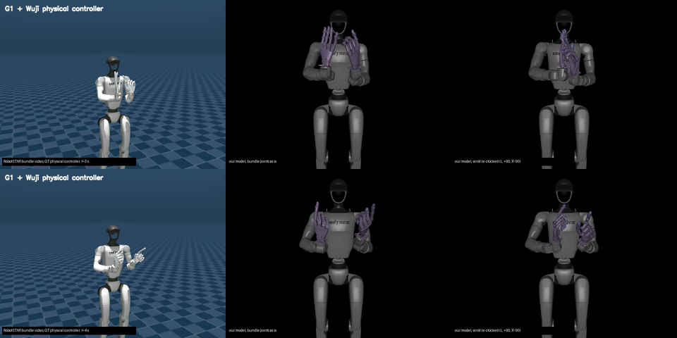

# Replayed clips: hands rotated 90 deg about the forearm

**Status:** 2026-09-12, `alex_dev`. Analysis done; the fix is committed
(`32e8bf0`: `tools/sanitize/reclock.py`, `tools/sanitize_clip.py --wrist-clock`,
[sanitize.md](../sanitize.md#wrist-clock), `prepare_clip.py` recording the
bundle's `detected_hand_model`). All 18 safe bundle clips are re-solved into
`clips/candidate/` with side-by-side videos ([results](#re-solve-results-2026-09-11));
none is re-filed. Not run on hardware.

## What is wrong

Every bundle clip plays with each hand rotated about 90 deg about its own
forearm axis, compared with the RobotSTAR videos the clip came from. Left
hand one way, right hand the other, mirror symmetric.

The cause is not in the clip pipeline. The bundle's arm joints were solved by
its authors against their own model, `scene_43dof_wuji_y90.xml`, which mounts
the legacy Wuji hand on the G1 wrist at a different clock angle than our
adapter. Our composed model and the rig agree with each other
([hardware_spec.md](../spec/hardware_spec.md#mounting-adapter), confirmed on
the rig 2026-09-05). The bundle disagrees with both. Replaying the bundle's
wrist angles verbatim therefore reproduces the bundle's *wrist link*
orientation, and puts the *hand* 90 deg off.

In plain terms, with an arm held straight forward at joint zero: our hands
sit with the palms facing each other and thumbs up; the bundle's model had
them palm down, thumbs inward.

Left column: the bundle's own physical-controller video. Middle: our model
driven by the bundle's joints as they are now (what `clips/safe/*.mp4` shows).
Right: the same frame after the correction described below.

## Evidence

All numbers from forward kinematics of the bundle's `body_q` through
`g1_29_wuji2_fixed.xml`, palm frame built from the wrist and the four MCP
bodies with the bundle's own palm-basis formula (reproduces the bundle's
`palm_basis_world` to 0.2 deg on the human data), compared with the bundle's
human palm targets after a per-clip world alignment.

| measurement | left | right |
|---|---|---|
| palm orientation error, bundle joints on our model, median over 30 trajectories | 87 deg | 101 deg |
| best single rotation per side that removes it, fitted jointly over all 30 | +86 deg | -101 deg |
| axis of that rotation, in `{side}_wrist_yaw_link` coordinates | 0.997 x | 0.998 x |
| residual after the correction, median | 19 deg | 27 deg |

The axis is the forearm (mount) axis on both sides to within 4 deg. The
angle is 90 deg mirrored, within the noise of the method: the residual left
over is the bundle's own IK error plus the alignment step (the bundle reports
4 to 16 deg mean palm error against the same targets). The asymmetry of the
fit (86 left, 101 right) is the bundle's own roll saturation, not a mount
angle other than 90: an independent re-derivation in this session, restricted
to frames where no source wrist joint sits within 12 deg of a limit, fits
+88.6 deg left (per-frame median +89.4) and -89.8 deg right (median -90.1)
about the same axis. Rendering the
corrected pose (figure, right column) matches the bundle video at every time
sampled. With the opposite signs, 84 percent of frames leave the wrist range,
so the sign is not in doubt.

**Working value: left +90 deg, right -90 deg about `{side}_wrist_yaw_link`
+x.** The exact angle should be read off the bundle authors' mount transform
(the `wuji` body in `scene_43dof_wuji_y90.xml`). If it is not +-90 about that
axis, the numbers above are wrong by the difference.

## The fix

Rotate the wrist target, not the wrist joint. The hand is mounted on the last
link, so the correction is a rotation of that link about its x axis, and the
G1 wrist is roll, then pitch, then yaw along that axis. "Add 90 deg to
wrist_roll" is exact only when pitch and yaw are zero. Over the bundle it is
off by a median 88 deg from the right answer, because the correction also
swaps the roles of pitch and yaw (new pitch is about the old yaw, new yaw
about minus the old pitch).

Two ways to apply it, measured on every 5th frame of all 30 trajectories:

| method | orientation within 10 deg | wrist link position error (median, 95th) | notes |
|---|---|---|---|
| closed form on the three wrist joints, clamped to limits | 99.5 percent | 5.0 cm, 6.6 cm | shoulder and elbow untouched; the pitch/yaw swap moves the yaw link on its 4.6 cm lever |
| sanitizer's full-arm IK with the rotated wrist placement | 89 percent | 0.3 cm, 12.6 cm | position and elbow held; the 11 percent are frames the wrist limits cannot reach, see below |

Recommended: the sanitizer. It already extracts the `wrist_yaw_link` placement
from the source joints and re-solves the arm under limits and collision
([sanitize.md](../sanitize.md)); the correction is one rotation applied to
that extracted placement before the solve, per side, gated on the clip's
provenance. 14 of the 18 bundle clips in `clips/safe/` went through it
already. The closed form is the right check to keep in the tests (it is what
the IK must reproduce when nothing binds).

Where the gate comes from: the bundle's `target_meta.json` carries
`"detected_hand_model": "legacy_wuji"`. `prepare_clip.py` should copy that
and the model path into `clip.json`, and the sanitizer applies the re-clock
only when it is present. The synthetic sweep clip (`90_sweep_joints_GT`) is
authored in joint space, has neither key, and must not be re-clocked.

## Scope

Code, small:

- `tools/sanitize/model.py` or `cli.py`: rotate each side's extracted wrist
  placement by the per-side angle; a `--wrist-clock` override; record it in
  `sanitize.json`. About 30 lines.
- `tools/prepare_clip.py`: record `detected_hand_model` and `model` from
  `target_meta.json` in `clip.json`. About 10 lines. The tool's own verdict on
  a legacy-hand clip is then advisory: the hand it audits faces the wrong way.
- Tests: closed form equals the IK when unconstrained; gate on and off; sweep
  clip untouched; roll-only is refused as an implementation. 4 to 6 tests.

Data, large: **every verdict in `clips/safe/` is void.** The hands rotate 90
deg, so every hand-to-hand contact in the audits was measured between the
wrong surfaces, and 9 of the 19 clips' peak contact pairs are hand-to-hand.
All 30 trajectories go back through prepare, sanitize, audit, and filing.
The `safe override` commits on `alex_dev` are the ones affected.

Docs: [spec1.md](../spec/spec1.md) step 1, [sanitize.md](../sanitize.md) flow
(sanitizer becomes mandatory for bundle clips), the mounting-adapter section
of [hardware_spec.md](../spec/hardware_spec.md), and the RobotSTAR bullet list
in `CLAUDE.md` (the bundle's joints assume a different hand clock).

Untouched: the hand joints (regenerated from keypoints, independent of the
arm), the PICO and glove teleop paths (their IK runs against our model), the
replay publisher and device nodes.

## Frames the fix cannot reach

After the re-clock the wrist joints sit better in their ranges than the
bundle's own solutions did: the bundle's right `wrist_roll` is pinned at its
+113 deg limit in more than half of all frames, and its left median is
-87 deg; after correction the median roll is near 10 deg and 7 percent of
side-frames touch a limit. The frames that stay unreachable are concentrated:

| trajectory | side-frames the full IK leaves >10 deg or >2 cm off | in `clips/safe/` today |
|---|---|---|
| 02_test Ours | 72 percent | yes, 0.25x |
| 03_test GT | 49 percent | no |
| 03_test Ours | 72 percent | no |
| 10_val Ours | 14 percent | yes, 0.25x |
| 11_val Ours | 21 percent | no |
| 14_val Ours | 22 percent | no |

The other 24 trajectories, including 16 of the 18 safe bundle clips, reach
the corrected pose in at least 95 percent of sampled frames. The residual on
the six above is 10 to 25 deg on the right hand for most of their frames;
whether that is acceptable is a per-clip call at filing time, as now.

## Re-solve results, 2026-09-11

Every safe bundle clip was re-solved from its current `clips/safe/` contents
with `tools/sanitize_clip.py --wrist-clock bundle` (collision on), re-audited
at 1.0, 0.5 and 0.25x, and rendered. Each candidate sits in
`clips/candidate/<clip>/` with `sanitize.json`, `reaudit.json`,
`replay_1.0x_reclocked.mp4` and `side_by_side_1.0x.mp4` (source video, the
bundle's own simulation, ours). Run on a Mac with MuJoCo 3.13 and Pinocchio
4.1; the unchanged `05_test GT` re-audits to its recorded numbers there (0.5x
passes at 0.736), so the version difference does not move the audit.

| clip | filed speed | before: peak torque ratio, peak contact | after: peak torque ratio, peak contact | worst wrist residual | frames with a wrist joint at its limit, left / right |
|---|---|---|---|---|---|
| 02_test Ours | 0.25x | 0.65, 65 N | 1.00, 197 N | 279 mm, 160 deg | 11 / 655 of 760 |
| 04_test GT | 0.25x | 1.00, 83 N | 1.00, 78 N | 29 mm, 4 deg | 0 / 0 of 150 |
| 04_test Ours | 0.25x | 0.76, 31 N | 1.00, 37 N | 28 mm, 5 deg | 0 / 0 of 150 |
| 05_test GT | 0.5x | 0.74, 35 N | 1.00, 16 N | 23 mm, 3 deg | 0 / 0 of 260 |
| 05_test Ours | 0.25x | 1.00, 37 N | 1.00, 17 N | 32 mm, 9 deg | 0 / 0 of 260 |
| 06_test GT | 0.25x | 1.00, 99 N | 1.00, 60 N | 33 mm, 6 deg | 0 / 0 of 390 |
| 07_test GT | 0.25x | 1.00, 150 N | 1.00, 204 N | 29 mm, 7 deg | 0 / 0 of 260 |
| 07_test Ours | 0.25x | 0.67, 96 N | 1.00, 133 N | 26 mm, 3 deg | 0 / 0 of 260 |
| 08_trai GT | 0.25x | 1.00, 28 N | 1.00, 39 N | 26 mm, 19 deg | 5 / 0 of 210 |
| 08_trai Ours | 0.25x | 1.00, 22 N | 1.00, 33 N | 27 mm, 4 deg | 0 / 0 of 210 |
| 09_trai GT | 0.25x | 1.00, 143 N | 1.00, 164 N | 28 mm, 7 deg | 0 / 0 of 360 |
| 10_val_ Ours | 0.25x | 0.84, 35 N | 1.00, 69 N | 31 mm, 26 deg | 0 / 245 of 590 |
| 11_val_ GT | 0.25x | 1.00, 59 N | 1.00, 49 N | 51 mm, 49 deg | 0 / 17 of 190 |
| 12_val_ GT | 0.25x | 1.00, 169 N | 1.00, 118 N | 29 mm, 8 deg | 0 / 0 of 350 |
| 13_val_ Ours | 0.25x | 0.76, 17 N | 0.85, 47 N | 28 mm, 5 deg | 0 / 0 of 320 |
| 14_val_ GT | 0.5x | 1.00, 128 N | 1.00, 86 N | 33 mm, 6 deg | 0 / 0 of 930 |
| 15_val_ GT | 0.5x | 0.74, 16 N | 1.00, 26 N | 23 mm, 3 deg | 0 / 0 of 200 |
| 15_val_ Ours | 1x | 0.78, 34 N | 1.00, 31 N | 24 mm, 17 deg | 0 / 0 of 200 |

**Orientation.** 13 clips follow the bundle video with a worst wrist
orientation residual under 10 deg. `08_train GT` and `15_val Ours` have short
excursions under 20 deg. `10_val Ours` pins its right wrist roll on 245 of 590
frames and is up to 26 deg off there; `11_val GT` on 17 frames, up to 49 deg.
`02_test Ours` pins the right wrist roll on 655 of 760 frames and the solve
breaks on some (279 mm, 160 deg): not usable as re-solved. This is the
reachability the analysis predicted for those trajectories.

**Audit.** Every candidate fails the 0.8 torque ratio at every speed
(`13_val Ours` reads 0.85 at 0.25x). Before the re-clock, 11 of the 18 already
read 1.00 at their filed speed and were filed by override. The saturating
joints are the 5 Nm wrist pitch and yaw actuators during hand-to-hand contact,
for 0.01 to 1.7 s of clip time at the filed speed (`05_test GT`: right wrist
yaw for 0.1 s at 0.5x; `15_val GT`: left wrist pitch for 1.7 s at 0.5x;
`12_val GT`: left wrist pitch 1.5 s and yaw 1.0 s at 0.25x). On `07_test GT`,
`09_train GT` and `12_val GT` the worst joint is the left shoulder roll at the
shoulder-to-torso contact, before and after the re-clock. Peak contact forces
stay in the range they were in. The wrist position residual of 23 to 33 mm on
every clip is the re-clock's cost with collision rows active, about three
times the collision-off floor ([sanitize.md](../sanitize.md#wrist-clock)).

**Open.** Filing policy: re-file at the previously filed speeds by override,
as the current safe set was filed, or run each on the rig first. `02_test
Ours` should not be re-filed as re-solved; `10_val Ours` and `11_val GT` are
partial.

## Not the fix

Re-clocking the physical adapter by 90 deg would make the bundle's joints
correct as they are, but it would also move the rig to the clock the bundle's
own solver saturated against (the +113 deg roll pinning above). Our clock is
the better one for these motions. Leave the hardware alone.

Re-solving from the human palm targets instead of the bundle's joints would
remove the bundle's own IK residual (the 19 to 27 deg above) as well. That is
the bundle authors' pipeline, not ours; the useful ask to them is to re-solve
with our composed model, or at least to send the mount transform so the angle
here can be pinned exactly.

## Afternoon test

Before the data rerun: re-file `05_test GT` through the corrected sanitizer,
render it, and compare against
`RobotSTAR_demos/samples/05_test_.../GT/videos/GT_g1_wuji_physical_controller_v7_2.mp4`
at t=3 s and t=4 s. The figure above is that comparison done kinematically.
On the rig: one static frame (frame 200 of that clip) next to the same
video frame, one arm, hand open. If the palms do not match the video after
the correction, the angle is not 90 deg and the authors' transform is needed
first.
