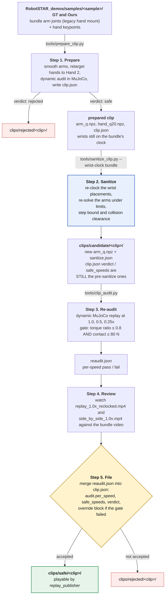

# Clip sanitization pipeline

`tools/sanitize_clip.py` re-solves a prepared clip's **arm** joints against
`g1_29_wuji2.urdf` with continuity, joint limits and full-mesh collision
checking, and writes the same npz arrays back. npz in, npz out: the result
drops into the replay path.

Offline only — no ROS, no DDS, no hardware. Runs in the `teleop` container
(Pinocchio + coal); nothing in it imports `mujoco`.

Spec: [spec/RoboSTAR_dropin_fix.md](spec/RoboSTAR_dropin_fix.md). Every
measured constant: [`../tools/sanitize/README.md`](../tools/sanitize/README.md).

## Where it sits



| Step | What runs it | Detail |
| --- | --- | --- |
| 1. Prepare | `tools/prepare_clip.py` | [Step 1](#step-1-prepare), [spec1.md](spec/spec1.md#offline-toolsprepare_clippy) |
| 2. Sanitize | `tools/sanitize_clip.py` | [Step 2](#step-2-sanitize), [Running it](#running-it), [Wrist clock](#wrist-clock), [Clearance](#clearance-is-part-of-the-solve) |
| 3. Re-audit | `tools/clip_audit.py` | [Step 3](#step-3-re-audit), [Reading the report](#reading-the-report) |
| 4. Review | a person, in a video player | [Step 4](#step-4-review) |
| 5. File | a person, editing `clip.json` | [Step 5](#step-5-file-candidate-to-safe) |

Hand joints pass through the sanitizer untouched (clamped to the URDF limits,
nothing else). Regenerating them is the retargeter's job, in step 1. Legs and
waist are read, never written.

## The five steps

### Step 1. Prepare

`tools/prepare_clip.py` turns one bundle sample into a clip directory: it
low-passes the arm joints (6 Hz Butterworth, 15 deg per frame step clamp),
retargets the bundle's hand keypoints to Hand 2 with the production
retargeter, replays the result dynamically in MuJoCo with the G1 node's gains,
and writes `arm_q.npz`, `hand_q20.npz` and `clip.json`.

**Constraints.** A single-frame arm step of 45 deg or more is refused outright
as an estimator orientation flip. Everything else is judged by the audit gate
in step 3, which prepare runs itself.

**It does not fix the wrist clock.** Prepare records the bundle's
`detected_hand_model` in `clip.json` `source` and stops there. Its own verdict
on a legacy-hand clip is advisory: the hand it audited faces 90 deg the wrong
way.

**Next:** step 2, for any clip whose source is a bundle sample.

### Step 2. Sanitize

`tools/sanitize_clip.py`. This stage. Mandatory for a bundle clip, because it
is where the wrist re-clock is applied. It re-solves the arm joints frame by
frame against `g1_29_wuji2.urdf`, seeded from the previous frame, with joint
limits, a velocity step bound and collision separation rows in the solve.

**Constraints.** Clearance 5 mm on 3576 geometry pairs; separation weight 3
against pose tasks at 1; a 5 deg trust region (`--avoid-budget-deg`) around
the pose-faithful answer. `wrist_clock.applied` must be `true` on a bundle
clip. Exit 3 (frames not cleared) is normal and is not a failure.

**Cost.** The re-clock trades wrist position accuracy for a correctly oriented
hand: see [what the re-clock costs](#wrist-clock).

**Next:** step 3, always. The tool writes no verdict.

### Step 3. Re-audit

`tools/clip_audit.py` on the sanitizer's output, at 1.0x, 0.5x and 0.25x.
This is the only measurement that describes the sanitized joint data.

**The gate.** A speed passes when **both** hold:

| | Threshold | Constant |
| --- | --- | --- |
| `peak_arm_torque_ratio` | at or below **0.8** | `DEFAULT_MAX_ARM_TORQUE_RATIO` |
| `peak_contact_force_n` | at or below **80 N** | `DEFAULT_MAX_CONTACT_FORCE_N` |

Nothing else in the report is a gate. `contact_frame_fraction`,
`arm_saturation_fraction` and `tracking_rmse_rad` are context for step 4.

**Next:** step 4. Write the result to `reaudit.json` in the candidate
directory. Do not edit `clip.json` yet.

### Step 4. Review

Render the sanitized clip and watch it. The candidate directories carry
`replay_1.0x_reclocked.mp4` and `side_by_side_1.0x.mp4` (the source video, the
bundle's own simulation, ours) for exactly this.

**What you are checking**, in order:

1. Do the palms match the bundle video? That is what the re-clock was for.
   Sample the same times the figure in
   [wrist-clock-2026-09-11.md](issues/wrist-clock-2026-09-11.md) uses.
2. Does the motion still read as the same gesture after the re-solve?
3. Where the clip fails the gate, is the failure the known benign one (wrist
   pitch or yaw actuators saturating for a fraction of a second during
   hand-to-hand contact) or something structural (a shoulder driven into the
   torso, an arm sweeping through the body)?

**Next:** step 5.

### Step 5. File, candidate to safe

Nothing before this point writes a verdict. The sanitizer **copies
`verdict`, `safe_speeds` and `audit` through from its input**, where they
describe the input's joint data, and `replay/clip.py::load_clip` reads exactly
those fields. A candidate directory whose `clip.json` still says
`"verdict": "safe"` is saying that about the pre-sanitize arms.

Filing is a person editing `clip.json`:

1. Replace `audit.per_speed` with the contents of `reaudit.json`, and set
   `audit.reaudited_after` to the sanitizer's `tool` string.
2. Set `safe_speeds` to the speeds you accept, and `verdict` to `safe` or
   `rejected`.
3. If any accepted speed did not pass the gate in step 3, write an `override`
   block saying who accepted it and why, with the numbers you accepted:
   `filed_by`, `filed_at`, `reason`, `filed_speed`,
   `accepted_peak_arm_torque_ratio`, `accepted_peak_contact_force_n`,
   `accepted_peak_contact_pair`, `thresholds`, `reaudit_passed_at`.
4. Move the directory to `clips/safe/`. `load_clip` refuses a clip whose
   parent directory is not named `safe` (`PLAYABLE_PARENT_DIR_NAMES`), and
   refuses any clip whose `verdict` is not `safe` or whose `safe_speeds` is
   empty.

**Most of the current safe set is filed by override, not by the gate.** Of the
18 bundle clips in `clips/safe/` today, 11 already read a torque ratio of 1.00
at their filed speed before the re-clock and were accepted on human review in
the MuJoCo viewer. The gate is a filter, not the decision. What the override
is for is recording which numbers a person looked at and accepted, so the next
person can disagree with a specific figure rather than with a judgement.

## The three defects

| Defect | What the tool does |
| --- | --- |
| Wrists phase through each other; nothing on the replay path checks | Sweeps 3576 URDF geometry pairs per frame with coal and constrains the frame's IK with what it finds. MuJoCo sees these contacts too, but reports a reaction force, not an overlap: `clip_audit.py` can say a pair pushed with 55 N, never that it interpenetrated |
| Branch flipping, torque and velocity spikes | Solves each frame from the previous one, shoulder→elbow then wrist, step-bounded by the URDF velocity limit. A joint jump the wrist pose did not follow is a flip: the source elbow is distrusted for its span |
| Wrist drift, hands inverted by the end | Measured and reported. Correction is opt-in (`--max-drift-deg`): a sign sequence need not end where it began |

## Running it

```bash
python3 tools/sanitize_clip.py clips/safe/<clip> -o clips/candidate/<clip>
python3 tools/sanitize_clip.py IN.npz -o OUT.npz     # flat npz, auto-detected
python3 tools/sanitize_clip.py clips/safe/<clip> --check        # measure only
python3 tools/sanitize_clip.py clips/safe/<clip> -o /tmp/x --no-collision

python3 tools/clip_audit.py <out>/<clip>             # then always this
```

A clip directory gets `sanitize.json` beside it and a `"sanitize"` block in
`clip.json`; a flat npz gets `OUT_sanitize.json`. Arm columns come back in the
input's order, and unknown keys pass through.

`sanitize.json` is the full report. The block in `clip.json` is the same
thing with the three per-frame collision lists replaced by their lengths,
`{"count": N, "in": "sanitize.json"}`, because repeating them made `clip.json`
a second copy of the report and up to 1.4 MB. Read `collision.failures`,
`near_miss` and `unfixable` from `sanitize.json`.

## Reading the report

| Field | Means | Act on it? |
| --- | --- | --- |
| `unwrap.wraps_removed` | 2π jumps taken out, only where the result still fits the joint's range | No |
| `unwrap.wrist_drift` | Each **source** wrist joint's end-to-start rotation, measured before the re-clock. On a re-clocked clip the output's wrist joints split the same wrist rotation differently (pitch and yaw roughly trade places, roll differs too), so read it as the source's drift | Past 90° it prints `DRIFT`. Your call per clip |
| `flips.detected` / `gated_frames` | Branch flips found, and frames run without the elbow task | A large gated count means the source elbow is untrustworthy |
| `ik.max_wrist_*_residual` | Worst pose error against what the source implied | ~0 on a clean unclocked clip; millimetres then mean limits, the step bound or a contact got in the way. On a re-clocked bundle clip a few mm of wrist position are inherent (median 1 to 9 mm, max 4 to 17 mm on the safe clips with collision off; elbow 18 to 45 mm): the rotated wrist placement and the source elbow position have no common 7-joint solution, and stage 3 splits the difference (wrist 1, elbow 0.5) while holding orientation to about 0.01 deg |
| `ik.frames_not_converged` | Frames whose solve did not reach the 1e-6 m / 1e-6 rad test | Meaningful only on an unclocked clip. On a re-clocked clip it is near the frame count for the reason above; judge the clip on the residual maxima, not this count |
| `ik.frames_at_joint_limit` / `at_step_bound` | Frames each joint spent on a bound | Usually a source outside the URDF range (`source.arm_values_outside_joint_limits`) |
| `wrist_clock.applied` / `deg` / `reason` | Whether the extracted wrist placements were re-clocked, by how much per side, and why | On a bundle clip `applied` must be true; see Wrist clock. Absent: the report was written before 2026-09-11 and the clip is not re-clocked |
| `hand.clamped_values` | Hand angles clamped into range | Fix the retargeter, not this |
| `collision.failures` | Frame, time, pair and state for every defect left | The decision list. Exit 3 |
| `collision.near_miss` | Inside the clearance, never touching | Normally nothing — signing brings the hands close on purpose |
| `collision.unfixable` | `intra_hand`: two segments of one hand | Nothing here can move them |
| `collision.frames_constrained` | Frames whose solve carried separation rows | How much of the clip is in contact |

Classes: `cross_side`, `arm_body` and `arm_self` are fixable by moving arms.
`intra_hand` is not.

A contact is either **touching** or a **near miss** with a gap. There is no
depth: coal returns 0.0 distance the moment meshes meet, however deep they go.

## Clearance is part of the solve

Each contact becomes one separation row inside **stage 3 of the frame's IK**,
weighted 3 against pose tasks weighted 1, re-measured every iteration. The
active pair set carries 15 frames, so a pair that just touched constrains the
next frame's first solve — the arm is held out of contact, not pushed out of
it. A frame that moves into an unknown pair is solved again with it added.

The bound is not optional: a touching pair asks for the full clearance every
iteration, so unbounded the solve walks off the pose for nothing (48° of
travel, 41 mm of wrist error, and 53 contacts where it started with 17).
`--avoid-budget-deg` (5°) is a trust region around the frame's pose-faithful
answer.

`05_test_G42xKICVj9U_5-5-rgb_front_Ours`, 260 frames, re-swept independently:

| | frames with a fixable touch | cross-side touching pair-frames | new arm/body contacts |
| --- | --- | --- | --- |
| source | 70 | 1770 | — |
| sanitized | **57** | **757** | **0** |

Worst wrist residual 19.1 mm / 3.5°, step out unchanged at 15°/frame. What it
does not fix: 1585 intra-hand pair-frames, and so the MuJoCo verdict — the
clip stays rejected at all three speeds. Arm saturation drops (0.104 → 0.027
at 1x). Hands inside each other are not an arm problem.

## Wrist clock

The bundle's arm joints were solved against its authors' model, which mounts
the hand on the G1 wrist 90 deg from this rig's adapter about the forearm
axis. Replayed as shipped they reproduce the bundle's wrist *link* and put the
*hand* 90 deg off, left and right in opposite senses
([wrist-clock-2026-09-11.md](issues/wrist-clock-2026-09-11.md)).

This stage corrects it where the geometry lives: each frame's extracted
`wrist_yaw_link` placement is rotated about its own +x by the clock angle
before the arm is re-solved, so the IK puts the hand where the bundle meant
it and keeps the wrist where the bundle put it. The angles are
`reclock.BUNDLE_WRIST_CLOCK_DEG`, +90 left and -90 right. It is not a
`wrist_roll` offset: the G1 wrist is roll, pitch, yaw along that axis, so the
correction also swaps the roles of pitch and yaw. Adding 90 deg to roll is
off by a median 88 deg over the bundle.

| `--wrist-clock` | Does |
| --- | --- |
| `auto` (default) | Applies the bundle clock when `clip.json` `source.detected_hand_model` is `legacy_wuji` (`prepare_clip.py` writes it from `target_meta.json`); otherwise nothing |
| `bundle` | Forces the bundle clock, for a clip prepared before the key existed |
| `none` | Forces it off |
| `--wrist-clock=LEFT_DEG,RIGHT_DEG` | Any two angles, for a source solved against some other mount. The `=` form is needed when `LEFT_DEG` is negative, or argparse reads the value as a flag |

The report says what happened under `wrist_clock`, and the stderr summary
prints one `wrist clock:` line. A flat npz has no `clip.json`, and a clip
directory whose `source` block lacks `detected_hand_model` or carries null
(the sweep clip, `90_sweep_joints_GT`) passes through unchanged unless the
flag says otherwise.

What the re-clock costs. The rotated wrist placement and the source elbow
position no longer share an exact 7-joint solution, so every re-clocked
bundle clip carries a small wrist position residual with nothing binding:
median 1 to 9 mm and max 4 to 17 mm over the safe clips with collision off,
with the elbow 18 to 45 mm off its source position and orientation held to
about 0.01 deg. Where a wrist range binds (about 7 percent of side-frames
over the bundle, concentrated in six trajectories) the IK gives up
orientation as well; where several wrist joints pin at once (`02_test GT`,
`03_test GT` and `Ours`, `14_val Ours`) it gives up centimetres of position
too. Read both `ik.max_wrist_pos_residual_mm` and
`ik.max_wrist_ori_residual_deg` at filing time.

With collision rows active the wrist position residual is about three times
that floor, 23 to 33 mm on every one of the 18 re-solved bundle clips, and
the orientation residual is under 10 deg on 13 of them. The exceptions are
the trajectories that pin a wrist roll: `10_val Ours` (26 deg, 245 of 590
frames pinned), `11_val GT` (49 deg, 17 frames) and `02_test Ours`, where the
solve breaks outright at 279 mm and 160 deg on 655 of 760 frames and the
clip is not usable as re-solved. Per-clip numbers:
[wrist-clock-2026-09-11.md](issues/wrist-clock-2026-09-11.md#re-solve-results-2026-09-11).

## Re-audit before filing. Always

The tool writes no verdict, and copies `verdict`, `safe_speeds` and `audit`
through from the input, where they describe the input's joint data.
`replay/clip.py::load_clip` reads exactly those fields.

So: re-audit ([step 3](#step-3-re-audit)), review
([step 4](#step-4-review)), then update `clip.json` and move the clip
([step 5](#step-5-file-candidate-to-safe)). Write the sanitizer's output under
`clips/candidate/` while you do, because `load_clip` refuses a clip whose
parent directory is not one it recognises.

## Exit codes

| | |
| --- | --- |
| 0 | clean |
| 3 | written and playable, N frames not cleared — a person decides |
| 2 | refused: bad arguments, or a model not collision-free at rest |
| 1 | unexpected error |

Exit 3 is normal on real bundle clips.

## Tuning

| Flag | Default | Change it when |
| --- | --- | --- |
| `--clearance-mm` | 5.0 | Rarely |
| `--fail-on` | `touch` | `clearance` also treats near misses as defects (~2 s/frame) |
| `--separation-weight` | 3.0 | Higher trades more pose for clearance; 10 measured worse |
| `--avoid-budget-deg` | 5.0 | Lower to protect the pose harder |
| `--avoid-passes` / `--avoid-iters` | 3 / 12 | Runtime; each pass is a 200 ms sweep |
| `--max-step-deg` | none | `15` reproduces `prepare_clip.py`'s clamp |
| `--max-drift-deg` | inf | You have decided the end pose is drift, not intent |
| `--no-collision` | off | Fast pose-fidelity check, ~1.5 s a clip |
| `--wrist-clock` | `auto` | `bundle` for a clip whose `clip.json` predates the provenance key; `none` to inspect a bundle clip unclocked; `--wrist-clock=L,R` for another mount (the `=` form when `L` is negative) |

## Runtime and tests

~0.25 s per frame on a mostly clear clip, ~1.2 s on one in contact throughout
(5m19s for 260 frames). One process per clip, single-threaded; six at a time
on 8 cores keeps the cores busy but stretches per-clip latency, so run it
detached.

```bash
python3 -m pytest tools/tests/test_sanitize_*.py -q     # 88 tests, ~10 s
```

Needs Pinocchio, coal and the URDF; skips cleanly without them.
