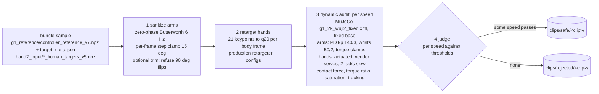
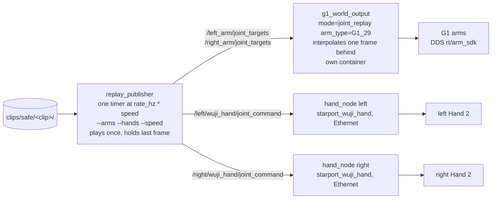

# Spec 1: clip replay on the G1 and two Wuji Hand 2

**Status:** design, 2026-09-02. What exists and what does not is in
[build status](#build-status). Operator commands: [replay.md](../replay.md).

Play every recorded clip in the handoff bundle on the real 29-DoF G1 arms
and both Wuji Hand 2 units. Two halves, one file boundary between them:

- **Offline** (`tools/prepare_clip.py`): turn a bundle sample into a clip
  directory. Smooth the arms, retarget the hands, then replay the whole thing
  dynamically in MuJoCo with the hands actuated and measure what the contacts
  do under our controller. Contact is expected in these clips (the hands
  touch each other and the body); the question the audit answers is how hard.
- **Online** (`replay_publisher` + two device nodes): publish the clip.
  Nothing else runs. No run-time checks of any kind; those can be added later
  behind the same file boundary without touching this graph.

## Clip directory

The boundary. One directory per trajectory, written by `prepare_clip.py`,
read by `replay_publisher`.

```
clips/
  safe/       <sample>_<GT|Ours>/     verdict safe at one or more speeds; the publisher searches here
  rejected/   <sample>_<GT|Ours>/     verdict rejected; kept for the report
  candidate/  ...                     scratch, gitignored
```

`clips/safe/` is tracked in git (a clip is about 300 KB). `rejected/` and
`candidate/` are gitignored. The whole `clips/` tree is bind-mounted into
the teleop container at the same relative path (`docker-compose.yml`).

| file | contents |
|---|---|
| `arm_q.npz` | `left`, `right`: `(T, 7)` float64 radians, one row per frame. Column order is `clip.json` `arm_joint_names` |
| `hand_q20.npz` | `left`, `right`: `(T, 20)` float64 radians, same `T`, in the hand driver's hardware order (`clip.json` `hand_joint_names`) |
| `clip.json` | see below |

`clip.json`:

```json
{
  "source": {"sample": "11_val_a5yNwUSiYpA_9-3-rgb_front", "method": "Ours", "bundle_manifest_sha256": "..."},
  "frames": 190, "rate_hz": 50.0,
  "arm_joint_names": {"left": ["left_shoulder_pitch_joint", "..."], "right": ["..."]},
  "hand_joint_names": {"left": ["l_thumb_cmc_flex", "..."], "right": ["r_thumb_cmc_flex", "..."]},
  "sanitize": {"cutoff_hz": 6.0, "max_step_deg": 15.0, "trim_start": 0, "trim_end": 0, "allow_flips": false,
               "before": {"max_step_deg": 26.0, "peak_vel_rad_s": 13.7}, "after": {"...": "..."}, "arm_rmse_rad": 0.013},
  "hand_retarget": {"config": "retarget_keypoints_topic_{side}.yaml", "config_sha256": {"left": "...", "right": "..."},
                    "clipped_fraction": {"left": 0.0, "right": 0.01}},
  "audit": {
    "model": "g1_29_wuji2_fixed.xml", "model_sha256": "...",
    "arm_gains": {"kp": 140.0, "kd": 3.0, "kp_wrist": 50.0, "kd_wrist": 2.0},
    "hand_command_slew_rad_s": 2.0,
    "thresholds": {"max_arm_torque_ratio": 0.8, "max_contact_force_n": 80.0},
    "per_speed": {
      "1.0":  {"pass": false, "peak_arm_torque_ratio": 0.93, "peak_contact_force_n": 142.0,
               "peak_contact_pair": ["right_shoulder_yaw_link", "torso_link"], "contact_frame_fraction": 0.31,
               "arm_saturation_fraction": 0.04, "hand_saturation_fraction": 0.12,
               "tracking_rmse_rad": {"arms": 0.09, "hands": 0.11}, "top_contact_pairs": ["..."]},
      "0.5":  {"pass": true,  "...": "..."},
      "0.25": {"pass": true,  "...": "..."}
    }
  },
  "safe_speeds": [0.5, 0.25],
  "verdict": "safe"
}
```

`verdict` is `safe` when at least one audited speed passes; `safe_speeds` is
the list that did. Every number the audit used to decide is in the file, so
a clip can be re-judged with different thresholds without rerunning the
simulation, and the operator can read what the arms will be asked for
before the first run.

## Offline: `tools/prepare_clip.py`

Runs inside the teleop container: it needs `numpy`, `scipy`, `mujoco`, the
retargeter (`wuji_retargeting`), the Hand 2 URDF (`wujihand_urdf`), and the
composed model (`g1_wuji2_description`), all of which the image has except
`scipy` (add to the Dockerfile).

```bash
python3 tools/prepare_clip.py --method-dir RobotSTAR_demos/samples/<sample>/Ours --out clips
python3 tools/prepare_clip.py --all RobotSTAR_demos/samples --out clips     # all 30, writes clips/summary.md
```



**1. Sanitize arms.** The existing algorithm (on the archived branch as
`tools/sanitize_robotstar_clip.py`): zero-phase second-order Butterworth at
`--cutoff-hz` (6) on the 14 arm columns, then a forward and backward
per-frame step clamp at `--max-step-deg` (15). `--trim-start N` and
`--trim-end N` drop frames. A single-frame step of 90 deg or more is an
estimator orientation flip; smoothing it produces a slow sweep through the
same wrong path, so the tool refuses unless `--allow-flips` is given, and
records that it was. Legs and waist columns are read but not written to the
clip: `g1_world_output` commands arm joints only, and the waist stays under
the robot's onboard controller. The audit holds the waist at zero for the
same reason.

**2. Retarget hands.** For each body frame `i`, take hand keypoint frame
`round(i * (T_hand - 1) / (T_body - 1))` (the same mapping the sim publisher
uses) and run it through the production retargeter with the
`retarget_keypoints_topic_{side}.yaml` configs, with `reset()` at frame 0.
Output is in the driver's hardware order, which is the URDF's declaration
order; the permutation the hand controller applies at runtime is applied
here instead. This is the only place hands are retargeted; the online path
never runs the retargeter.

**3. Dynamic audit, per speed.** For each speed in `--speeds` (default
`1.0 0.5 0.25`), replay the clip through `mujoco.mj_step` on
`g1_29_wuji2_fixed.xml` (fixed base, 2 ms timestep, waist and legs held at
the stand keyframe):

- Arm actuators are re-gained to what `g1_world_output` sends: kp 140 / kd 3
  on shoulder and elbow joints, kp 50 / kd 2 on the three wrist joints, torque
  clamped at the model's `actuatorfrcrange` (25 Nm arm joints, 5 Nm wrist
  pitch and yaw). The model's own menagerie gains (kp 500) are not used.
- Arm targets advance one clip frame every `1 / (rate_hz * speed)` seconds
  and are linearly interpolated between frames, which is what the fixed G1
  node does (see [build status](#build-status)).
- Hands are **actuated**, on the vendor's force-limited position servos as
  the model ships them, with the hand driver's behaviour modelled on the
  command stream: targets slew-limited at 2 rad/s and clamped to the joint
  ranges. A clip with the hands frozen at neutral would show contacts the
  real hands move out of, and miss the ones they move into.
- The first frame is approached from the stand keyframe over 2 s before the
  clock starts, so the audit measures the clip and not the startup step.
  The clip is followed by a 0.5 s hold.

Recorded per speed: peak contact force and its body pair, the five largest
pairs, fraction of frames with any contact, peak arm joint torque as a
fraction of its clamp and the fraction of frames any arm joint sits at the
clamp, hand servo saturation fraction, arm and hand tracking RMSE. Sign
convention and units follow `mj_contactForce`.

**4. Judge.** A speed passes when `peak_arm_torque_ratio <=
--max-arm-torque-ratio` (default 0.8) and `peak_contact_force_n <=
--max-contact-force-n` (default 80, the bundle authors' own deployment gate,
kept only as a starting number). Hand saturation is reported, not judged:
the real driver's 0.6 A ceiling bounds it and the servo model's units are
not the driver's. The thresholds are choices. The audit's job is to make
the numbers visible; deciding what a stalled shoulder against the torso
shell may do is not something the simulation knows.

**Where the audit is honest and where it is not.** It uses our gains, our
model with the wrist contact-exclude, and actuated Hand 2 units. It does not
know real contact stiffness, the hand mount adapter's strength (still an
unconfirmed part), harness snags, or the G1 firmware's behaviour at a torque
clamp. Read `peak_contact_pair` as much as the number.

**If every clip is rejected.** Expected for some of the 30: on the corrected
model, 29 of 30 penetrate deeper than 10 mm somewhere when the hands are
frozen at neutral. The ladder, cheapest first, each an option `clip.json`
records: run slower (`--speeds` down to 0.1); trim (`--trim-start`,
`--trim-end`, or `--auto-trim` for the longest passing window of at least
`--min-seconds` 3); raise a threshold with a reason written in
`--note`. Nudging contacting frames with a local IK and re-solving the arm
retarget against this model are real fixes for presses and flips
respectively, and are separate work items, not part of this tool.

## Online: play a clip



Four processes, two containers. `wujihand_controller` (the glove-teleop
retargeter) is not on this path.

**`replay_publisher`.** Arguments:

| flag | values | meaning |
|---|---|---|
| `--clip DIR` | a directory under `clips/safe/` | refuses any directory whose `clip.json` `verdict` is not `safe` |
| `--arms` | `none`, `left`, `right`, `both` (default `both`) | which arm topics are published. `none` publishes nothing to the G1 node |
| `--hands` | `none`, `left`, `right`, `both` (default `both`) | which hand driver topics are published |
| `--speed S` | `0 < S <= 1`; default: the largest value in `safe_speeds` | timer period is `1 / (rate_hz * S)`. Same frames, published slower. Amplitudes unchanged, peak velocity scales by `S`, acceleration by `S^2`. A value larger than the largest `safe_speeds` entry is refused |
| `--loop` | | restart at frame 0 instead of holding the last frame |

Behaviour: one timer; at each tick publish frame `i` for every selected
side, with joint names on every message; at the end hold the last frame
(keep publishing it) until killed. The first published frame is a step
from wherever the robot is to frame 0: on the arm side the G1 node's
velocity clip is the only limiter, on the hand side the driver's slew limit.
No approach ramp here, by decision; if one is wanted it is clip content
written by `prepare_clip.py`.

**Arms.** `g1_world_output` in `joint_replay` mode, `arm_type=G1_29` (the
config default), own container. It matches joints by name and writes DDS
through `G1ArmController` at `control_rate` 250 Hz. It is meant to
interpolate between the two newest samples; today it does not (build
status): the interpolation parameter is `(now - t_prev) / (t_next - t_prev)`
with `t_next` the newest sample's arrival time, so at every tick it is at or
past 1 and the output is a zero-order hold at the publish rate. At
`--speed 0.25` that is a 12.5 Hz staircase into a stiff PD. Fix: interpolate
one publish period behind, `alpha = (now - t_next) / (t_next - t_prev)`
between `q_prev` and `q_next`, clamped. One frame of latency, continuous
command at any speed.

**Hands.** One `starport_wuji_hand` `hand_node` per side, namespaced
`/left/wuji_hand` and `/right/wuji_hand`. The driver finds its hand by UDP
broadcast scan and serial number (the host NIC must have an address on the
hands' subnet), homes it on connect (3 s), and accepts named `JointState`
in radians on `~/joint_command`. It publishes measured state on the global
`/joint_states` (both hands; `l_` and `r_` prefixes) and `~/connected`.
What the driver does between a received command and the SDK (2 rad/s slew,
soft-limit clamp, hold on stale, idle release after 5 s without commands)
is the driver's own and is set by its launch arguments; this spec adds
nothing to it and mirrors the slew in the offline audit.

**Topics.**

| topic | type | producer | consumer |
|---|---|---|---|
| `/left_arm/joint_targets`, `/right_arm/joint_targets` | `sensor_msgs/JointState`, 7 named | `replay_publisher` | `g1_world_output` |
| `/left/wuji_hand/joint_command`, `/right/wuji_hand/joint_command` | `sensor_msgs/JointState`, 20 named | `replay_publisher` | `hand_node` |
| `/left_arm/joint_states`, `/right_arm/joint_states` | `sensor_msgs/JointState` | `g1_world_output` | connection check |
| `/joint_states` | `sensor_msgs/JointState`, both hands | `hand_node` x2 | connection check |
| `/left/wuji_hand/connected`, `/right/wuji_hand/connected` | `std_msgs/Bool` | `hand_node` | connection check |

**Launch and the single terminal.** `replay.launch.py` (teleop container)
starts the hand drivers for the sides in `hands` and the publisher. The G1
node cannot be in that file (other container). `scripts/replay.sh` on the
host does both: starts the G1 container detached unless `--arms none`, runs
the teleop launch in the foreground, stops the G1 container on exit. Its
flags are the publisher's plus `--check` (drivers and G1 node only, print
state rates, exit) and `--sim` (G1 node with `dry_run`, no hand drivers,
MuJoCo viewer instead). Exact commands: [replay.md](../replay.md).

## Out of scope, by decision

Nothing runs between the publisher and the device nodes: no run-time checks
or trip conditions (temperature, effort, contact), no e-stop logic, no
approach ramp. Teleop (glove, PICO) is untouched and shares only
`g1_world_output` with this path.

## Build status

| piece | state | work |
|---|---|---|
| `tools/prepare_clip.py` | not built | new. Sanitizer exists on the archived branch (`alex_dev_debt_backup`, `tools/sanitize_robotstar_clip.py`); add retarget, dynamic audit, judge, filing, `--all` with `clips/summary.md` |
| `scipy` in the teleop image | check | add to `docker/Dockerfile` if absent |
| `clips/` | not built | `docker-compose.yml` bind-mount `../clips`; `.gitignore` `clips/candidate/` and `clips/rejected/` |
| `replay_publisher` | built for the bundle layout and keypoint topics | read the clip directory; publish `hand_q20` on the driver topics with names; `--clip`, `--arms`, `--hands`, `--speed` as above; refuse non-safe |
| `g1_world_output` `joint_replay` | built; interpolation is a zero-order hold (reproduced 2026-09-02 with the buffer class in isolation) | interpolate one publish period behind, as above |
| `starport_wuji_hand` driver | source in hand, not in this repo | vendor into `src/`; rewrite its README (it describes the USB version); drop the two tests that read files outside this repo; confirm the pinned `wuji-sdk` exposes the Hand 2 API; check Humble `launch_ros` accepts its `list[float]` parameter typing |
| `replay.launch.py` | not built | drivers for `hands` sides + publisher; args `clip`, `arms`, `hands`, `speed` |
| `scripts/replay.sh` | not built | host wrapper, `--check`, `--sim` |
| model fix | on the archived branch (`6c08acd`) | cherry-pick the wrist roll/yaw contact-exclude in `g1_29_wuji2*.xml` |
| `wujihandros2` (USB driver) | present | remove the submodule and the `wujihandcpp` deb once the Ethernet driver runs |
| `wujihand_controller` | built, teleop only | none |
