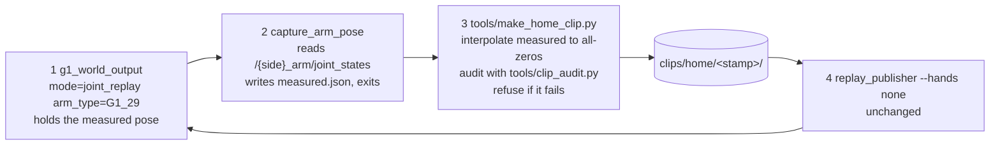

# Spec 1.1: operator-initiated rehome

**Status:** built 2026-09-03, not run on the rig. The audit matrix that decides
the home pose has run: [home-audit-matrix-2026-09-03.md](../issues/home-audit-matrix-2026-09-03.md).
Extends
[spec1.md](spec1.md), which is unchanged: the replay path stays exactly as it
is. Operator commands: [replay.md](../replay.md). Per-piece state:
[build status](#build-status).

## The problem

Nothing brings the arms back to a known pose. `G1ArmController.shutdown()`
ramps the `arm_sdk` weight 1 to 0 over about 1.02 s and the onboard controller
then holds the arms wherever the last command left them. `move_to_init` is
pose-IK and raises `NotImplementedError` for `arm_type=G1_29`, which is this
rig. `ctrl_dual_arm_go_home()` exists in `robot_arm.py`, has no callers, steps
to all-zeros in one write with the 20 rad/s DDS clip as its only limiter, and
ends by releasing the arms. So a clip that finishes with the arms folded
against the torso, or an operator Ctrl-C mid-clip, leaves them there.

## What this is, and what it is not

One deliberate operator command, `scripts/replay.sh --home`, that moves the
arms slowly to a known pose. It is not an e-stop and must not be documented or
described as one: it takes seconds by design. The fast stop remains the
remote's damp command or main power
([hardware_spec.md](hardware_spec.md)).

It adds no runtime layer. Nothing new sits between the publisher and the
device nodes, there is no supervisor, no state machine, no gate, no trip, no
watchdog, and nothing in the replay path can trigger it. It is reachable only
by typing `--home`, and `--home` refuses a clip argument.

## Home is all-zeros

The vendor's own `arm_sdk` convention. In
`unitree_sdk2_python/example/g1/high_level/g1_arm7_sdk_dds_example.py`, stage 1
is commented "set robot to zero posture" and commands
`q = (1 - ratio) * measured_q` with ratio going 0 to 1 over 3 s; stage 3 is
"set robot back to zero posture"; stage 4 then ramps the weight to 0. Ending
our rehome at all-zeros leaves the arms in the state that vendor sequence
leaves them, so the existing weight ramp in `shutdown()` hands them back at the
pose the onboard controller expects.

The rival was the MJCF `stand` keyframe (shoulder pitch 0.2, roll +/-0.2,
elbow 1.28, wrists 0), on the grounds that `clip_audit.py` approaches every
clip's first frame from it. That is a fact about the audit harness, not about
the robot. `stand` is a posed keyframe, its elbow flexion puts both hands in
front of the abdomen where the audit's hand-to-hand contact pairs come from,
and [architecture.md](../architecture.md) already records that an arm with
nothing publishing to it settles at all-zeros rather than at the keyframe.
All-zeros also carries the lowest gravity load and sits within 0.25 rad of
where every committed clip starts.

The cost expected of it was that it lays both Hand 2 units alongside the hips,
and that geometry is not the bare G1's. The
[audit matrix](../issues/home-audit-matrix-2026-09-03.md) measured that and
found the opposite: the hip-to-pinky contacts belong to the stand home, not the
zeros home, because the hands pass the thighs on the way to either pose and
stand's 1.28 rad elbow holds them there longer. Across the four non-degenerate
start poses all-zeros gives the lower peak contact in three (0.8 N against 13.1,
8.5 and 9.0) and is within 1.3 N in the fourth. Torque ratios are
indistinguishable, 0.27 to 0.36 either way.

## The program

Three short-lived processes in sequence, then the existing publisher. The
motion the robot performs is an ordinary clip, audited seconds before it plays,
played through the same `side_buffer` interpolation into the same node. One
motion path in the system, not two.

Steps 2 and 3 command nothing. Step 4 is the only thing that moves the arms,
and its frame 0 is the pose captured in step 2, so the first published frame
is a no-op against where the arms already are.

`--home` is a separate invocation that re-acquires the arms, not a mode of a
running session. A mode would be new runtime state, and it would be unavailable
in the case that matters, which is after a Ctrl-C. Re-acquiring is safe because
the node's first command is now the measured pose (see
[the prerequisite](#prerequisite-seed-q_target-from-measured)). It cannot run
while a replay holds the arms: `G1ArmController` takes an exclusive flock on
`/tmp/g1_lowcmd_writer.lock`, so the second writer is refused at startup. Two
things never command the arms at once.

## The motion

A half-cosine ease, `s(t) = (1 - cos(pi t / T)) / 2`, at 50 Hz, played at speed
1.0 only. Every number is a named constant in `tools/make_home_clip.py` with
its arithmetic in the comment.

| quantity | value | where it comes from |
|---|---|---|
| peak velocity | 0.2 rad/s | 40% of the 0.5 rad/s deploy screening velocity in `tools/sweep_joint_limits.yaml`. At the node's wrist kd of 2 the damping term is 0.4 Nm against a 5 Nm clamp, 8%; on the other arm joints 0.6 Nm against 25 Nm |
| duration | `T = clamp(dq_max * pi / 0.4, 3, 30)` s | inverts the ease's peak velocity `dq * pi / (2T)` |
| peak acceleration | `dq * pi^2 / (2T^2)` | at most 0.209 rad/s^2, reached at a travel of 0.382 rad where the 3 s floor starts to bind, and falling to 0.026 at the largest legal travel. Against the 3.0 rad/s^2 deploy value |
| frame count | `ceil(T * 50) + 1` | rounded up, not to nearest: n frames span (n - 1) periods, so rounding down shortens the motion and lifts peak velocity over the limit. Measured at 0.2003 rad/s from the stand pose before this was ceil |
| frames | `round(T * 50)` | the rate every prepared clip uses, so the node's one-frame-behind interpolation adds the usual 20 ms |
| audited speeds | 1.0 | the duration is already in the clip; a speed knob on a fixed-duration motion is a second way to get it wrong |

Worked ends of the range. From a clip's last frame, within 0.25 rad of zeros,
`T` is 1.96 s and clamps up to the 3 s floor, which lowers peak velocity to
0.131 rad/s and gives 0.137 rad/s^2. The largest travel any in-range start pose
can produce is 3.0892 rad, shoulder pitch at its lower limit, giving `T` = 24.3
s at 0.200 rad/s and 0.026 rad/s^2. So the 30 s cap is unreachable from a legal
pose and exists only to bound a nonsense input.

Cosine rather than linear costs nothing and removes the argument. It is not a
safety claim: the linear velocity step it avoids is 0.2 rad/s into kd 3, which
is 0.6 Nm.

Frame 0 is the captured pose verbatim, including a joint sitting outside the
model range (the handoff note records four wrist joints commanded past their
model limits). Frames 1 onward are clamped to the model range and the
out-of-range joints are named in `clip.json`.

## The hands are not homed

They go limp on `hand.disable()` in the driver's `_disconnect`, which is the
right rest state: a limp hand cannot press. The driver homes to the zero pose
over 3 s on connect, so any hand is opened again the next time a driver starts.
`--home` therefore starts no hand driver and publishes no hand topic. Bringing
them in would mean commanding a 3 s move to zero before any arm motion had been
audited against the pose the arms are actually in, which is worse.

The clip still carries a `hand_q20.npz`, because the loader requires one, and
its columns are never published. What the audit assumes for hand geometry is
recorded in `clip.json`: an open hand, and a curled stand-in with every flex
joint at 70% of its upper range and abduction at zero, which puts the finger
PIP joints near 1.4 rad. The worse of the two decides.

The gap this leaves, and it belongs in the runbook: if the fingers are
interlocked when homing starts, the arms will move with them interlocked.
Separate them first.

## Prerequisite: seed `q_target` from measured

Found while tracing, and this design depends on it.
`G1ArmController.__init__` set `q_target` to zeros and then started the DDS
write thread. That thread steps the `arm_sdk` weight to 1.0 on its first tick
and clips toward `q_target` at 0.08 rad per 4 ms tick, and nothing wrote a real
target until the node's first control-loop callback, which is after the rest of
node construction and `rclpy.spin` starting. So every G1 node start, replay runs
included, walked the arms toward all-zeros for the length of that window and
then held wherever they reached, at a pose that depended on how long startup
took.

Fixed by reading measured into `q_target` before the thread starts, which is
how the vendor example gets its own acquire (stage 1 at ratio 0 commands the
measured pose). Being in the direction of home does not make the old behaviour
a rehome: it was uncommanded, unaudited, ran at up to 20 rad/s, and stopped
somewhere different every time.

## Conventions considered and not used

| convention | what it is | why not |
|---|---|---|
| `release arm`, action id 99, on the onboard `arm` RPC service | the vendor's real rehome; every gesture preset in `g1_arm_action_example.py` ends with it | a different authority from `arm_sdk`, so the weight must be released first, and its trajectory and target are the firmware's. It cannot be audited against `g1_29_wuji2_fixed.xml`, and it was designed for a bare G1 with no Hand 2 units, no mount adapter and no added wrist mass |
| `LocoClient.Damp()` (FSM 1), `ZeroTorque()` (FSM 0) | the relax and backdrivable modes | stops, not homes: whole-body, neither holds a pose, and zero torque drops a standing robot. Damp is already this rig's physical stop and already the remote's button |

Worth running once on the rig and recording, while the arms are acquired:
`G1ArmActionClient.GetActionList()`, to see whether action 99 is offered at
`mode_machine` 5 with the waist locked. Informational. Nothing depends on it.

## What the audit matrix found

Eight start poses, both home candidates, both assumed hand poses. Full table:
[home-audit-matrix-2026-09-03.md](../issues/home-audit-matrix-2026-09-03.md).
Three results:

**Every realistic start is safe.** The five committed clips' end poses, `stand`
and `zeros` all pass, at torque ratios 0.27 to 0.36 against a 0.8 threshold and
peak contact 0.4 to 13.1 N against 80 N.

**A straight interpolation does not press harder, unless it starts in contact.**
Peak contact in the first second exceeds contact at frame 0 by +0.0 N on every
safe row. The synthetic folded pose is the exception at +5.6 N, and it begins at
42.6 N of contact with the torque ratio already saturated at frame 0.

**No path shape rescues a folded start.** A retract waypoint, shoulder roll
outward and then descend, was built and measured: 133.3 N with it against 133.4
without from a pose with roll headroom, and slightly worse from one at the roll
limit. The binding pair is `shoulder_yaw_link` against `torso_link`, which
abduction does not relieve. The waypoint was removed rather than kept unused.

So the answer for a folded start is the refusal: the generator files the clip
under `clips/rejected/`, exits 2, and the publisher never starts. Damp from the
remote and part the arms by hand. What remains open is only whether the rig
agrees with the model, which nothing offline can settle.

## Build status

| piece | state | remaining |
|---|---|---|
| `q_target` seeded from measured, `robot_arm.py` | written; 10 tests, the first coverage of `G1ArmController` in that package, against stubbed SDK modules | confirm on the rig from `/left_arm/joint_commands` |
| `tools/make_home_clip.py` | written; 51 tests, and run end to end against MuJoCo 3.12.0 | none |
| `capture_arm_pose` | written; 22 tests | run against the G1 node |
| `clips/home/` accepted by `replay/clip.py` | written; the root check is a tuple, the verdict check is unchanged | none |
| `scripts/replay.sh --home` | written; 25 tests through `--print-plan`, no Docker | run on the rig |
| the audit matrix | run: 16 rows, home pose confirmed, retract waypoint measured and dropped | none |
| the whole path in sim | not run: needs Docker | `scripts/replay.sh --home --sim --from clip:...@last` |
| anything on the rig | not run | |
