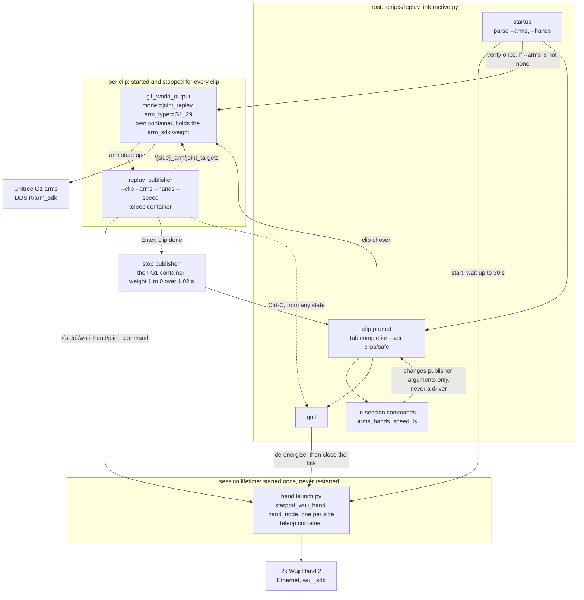
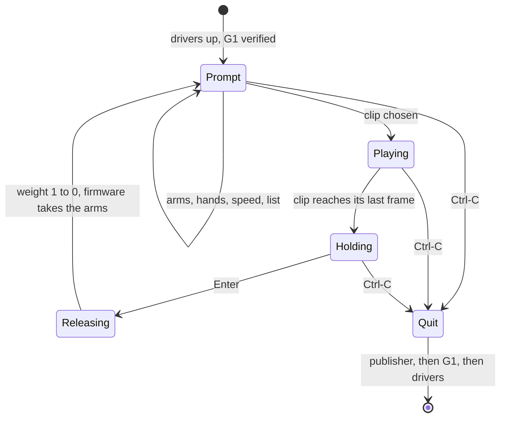

# Spec 1.2: interactive replay session

**Status:** plan, 2026-09-08. Nothing is built. Extends
[spec1.md](spec1.md), which is unchanged: the graph that plays a clip stays
exactly as it is, and this spec adds a layer above it. Supersedes
[spec1_1.md](spec1_1.md), which is scheduled for deletion
([Removing the rehome](#removing-the-rehome)). Operator commands once built:
[replay.md](../replay.md).

Play several clips in one sitting without paying the hand connection cost
between them, and change which arm and which hand are driven without
restarting anything.

## The problem

Every `scripts/replay.sh <clip>` reconnects to the hands, which takes 10 to
30 s. The cost is structural, not a tuning problem, and it comes from three
facts:

1. `replay_publisher` holds the last frame until it is killed. It never exits
   on its own ([replay_publisher.py](../../src/input_devices/replay/replay/replay_publisher.py)
   docstring, step 3).
2. [replay.launch.py](../../src/wuji_teleop_bringup/launch/replay.launch.py)
   gives the publisher `on_exit=Shutdown()`. When the publisher ends, the
   launch takes the hand drivers down with it.
3. `replay.sh` starts the G1 container per invocation and stops it in
   `cleanup()`.

So the hand drivers' lifetime is bound to one clip's. The 10 to 30 s is the
hand side specifically: a UDP broadcast scan, connect by serial, up to ten
attempts, then the driver's blocking 3 s home sweep. Nothing else in the
startup is near that.

Breaking fact 2 is the whole change. Facts 1 and 3 stay as they are.

## What does not change

Stated first, because this layer is the kind of thing that grows into a
supervisor by accretion, and [CLAUDE.md](../../CLAUDE.md) rules that out.

- The clip-playing graph is still `replay_publisher` plus the two device
  nodes. No FSM, no supervisor, no gates, no trip conditions, no runtime
  checks.
- Clip quality is still decided offline by `tools/prepare_clip.py`. The
  session never judges a clip, never reads a `clip.json` verdict to make a
  decision of its own, and never refuses a clip that the publisher would
  accept.
- The publisher still plays a clip once at 100 Hz and holds the last frame.
- The arms are still released by the same `arm_sdk` weight ramp that runs
  today, in the same code, triggered the same way.
- `scripts/replay.sh` stays exactly as it is, one clip per invocation, with
  its exit-code contract intact. It is what tests and scripts use. The
  session is a second entry point beside it, not a replacement.

The session may do four things and nothing else: list clips, start and stop
the G1 container, start and stop one publisher, and start the hand drivers
once at the beginning and stop them once at the end. It reads no robot state
and makes no safety decision.

## Architecture



## Lifetimes: what persists and what cycles

| piece | lifetime | why |
|---|---|---|
| hand drivers | the whole session | this is the 10 to 30 s being removed |
| G1 container and node | one clip | it is what releases the arms, and its start cost is seconds |
| `replay_publisher` | one clip | unchanged behaviour: plays once, holds the last frame |

**The G1 cycles on purpose.** Keeping it up across clips would leave the arms
held stiff at the last frame with the weight at 1, and Ctrl-C would no longer
release them. The weight release lives in
`G1ArmController.shutdown()`, which runs when the container stops
([robot_arm.py:470](../../src/output_devices/g1_world_output/g1_world_output/robot_arm.py#L470)):
51 steps of 0.02 s, about 1.02 s, still commanding the last frame while the
weight blends out. Cycling the container is what keeps that behaviour byte for
byte, and it also means the arms are firmware-owned while an operator stands
next to the robot picking the next clip.

The cost of that choice is one G1 container start per clip: a
`docker compose run` plus the Pinocchio and CasADi import that `g1_controller`
does unconditionally. **This has not been measured.** It is the one number
that decides whether this design is right, and it should be measured before
the code is written ([To measure](#to-measure)).

## Startup

`--arms` and `--hands` keep the meaning they have in `replay.sh`: `none`,
`left`, `right`, `both`, default `both` each. They select what the session
connects to, once.

```
scripts/replay_interactive.py                            # both hands, both arms
scripts/replay_interactive.py --hands left               # left hand only, both arms
scripts/replay_interactive.py --arms right --hands none  # right arm only, no hand driver
scripts/replay_interactive.py --arms none --hands none   # connect nothing (see below)
```

In order:

1. Refuse a bad flag combination before anything starts, the way `replay.sh`
   does.
2. Unless `--hands none`, start `hand.launch.py` for the selected sides in the
   teleop container, detached, and wait up to 30 s for
   `/{side}/wuji_hand/connected`. This is the same 30 s window the publisher's
   ready wait and `replay_check` already use. A side that does not report is a
   startup failure: exit non-zero and say which, rather than entering the loop
   half-connected.
3. Unless `--arms none`, verify the G1 once: start its container, wait for
   `/{side}_arm/joint_states` on the selected sides, then stop it. This takes
   and releases the arms once before the first clip, which is what
   `replay.sh --check` already does, and it means an unreachable robot or a
   wrong `network_interface` fails at startup rather than on the first clip.
4. Enter the clip loop.

`--arms none --hands none` connects nothing and enters the loop with no
device. It exists so the loop, the prompt, the completion and the command
parser can be exercised on a laptop with no Docker and no hardware. In that
mode choosing a clip starts nothing and prints the command it would have run.

## The clip loop



The operator drives every transition.

- **Prompt.** Read a line with tab completion over `clips/safe`. A bare Enter
  lists the clips. A recognised command changes session state and returns
  here. Anything else is treated as a clip name.
- **Playing.** Start the G1 container, then the publisher. Same two commands
  `replay.sh` issues today, same arguments, with the session state as
  `--arms`, `--hands` and `--speed`.
- **Holding.** The clip has reached its last frame and the publisher is
  holding it, arms stiff, weight 1. Nothing has been released. This is where
  the operator looks at the result.
- **Releasing.** Stop the publisher, then the G1 container. The weight ramps 1
  to 0 over 1.02 s and the firmware takes the arms. Back to the prompt with
  the hand drivers still up.

### Ctrl-C

**Ctrl-C always stops everything and exits, from any state.** There is one
meaning and no mode in which it means something else. It is the same
guarantee `replay.sh` gives today and it is not negotiable against
convenience.

The teardown is ordered, and the order is what makes it safe:

1. the publisher, so nothing is still writing joint targets;
2. the G1 container, whose node ramps the `arm_sdk` weight 1 to 0 over
   1.02 s, handing the arms to the firmware;
3. the hand drivers, which de-energize each hand and close its link.

Step 2 must not be skipped or raced. The G1 node runs in its own container,
so a signal that kills the publisher does not touch it; the session's trap
stops it explicitly and waits, exactly as `replay.sh`'s `stop_g1` does. The
same trap runs whether Ctrl-C arrived during Playing, Holding or at the
Prompt.

There is no mid-clip abort that keeps the session alive. Stopping a clip early
means Ctrl-C, which quits and costs the hand reconnect on the next start. That
is the deliberate trade for one unambiguous Ctrl-C.

### Who owns the terminal

A consequence worth stating, because it decides how the loop is written. The
publisher holds the last frame forever and never exits on its own. If it ran
in the foreground it would own the terminal, and the session could not read
the Enter that ends the clip. So the publisher runs as a background
subprocess and the session keeps the terminal: it reads Enter, and its signal
handler performs the ordered teardown above. `replay.sh` can keep the
publisher in the foreground because it never needs to read anything after the
clip starts.

**The hands between clips.** The publisher stops, so commands stop, so each
hand driver idle-releases after 5 s (`idle_release_s`, default 5.0) and the
fingers go limp. The next clip's publisher re-commands them, the driver
re-acquires and re-seeds from where the hand actually ended up, and the
publisher's 2 s ramp approaches frame 0 from there. This is today's behaviour
and it is kept deliberately: limp fingers between clips are a visible marker
of where one clip ended and the next began.

## Command surface

### In-session commands

Canonical spelling mirrors the CLI flags, so there is one vocabulary across
the repo:

| command | effect |
|---|---|
| `arms none\|left\|right\|both` | which arm topics the next clip's publisher writes |
| `hands none\|left\|right\|both` | which hand topics it writes |
| `speed S` / `speed auto` | `--speed` for the next clip; `auto` means the clip's fastest safe speed |
| `ls` | the clips under `clips/safe`, with each one's safe speeds |
| `state` | the current selection, and what the session is connected to |
| `help` | the table above |
| `quit` | leave the loop and stop the hand drivers |

`ls` rather than `list`, to match the shell. A bare Enter does nothing and
reprompts, the way a shell does. Listing is `ls`, or Tab on an empty line.

`ls` reads each clip's `clip.json` to show its safe speeds. That is display,
not judgement: the session shows the numbers and never decides anything from
them.

Aliases, since they read better mid-session, mapping onto the same state:
`left_arm_off`, `left_arm_on`, `right_arm_off`, `right_arm_on`,
`left_hand_off`, `left_hand_on`, `right_hand_off`, `right_hand_on`.

### Speed

Session state, defaulting to `auto`, which is the clip's fastest safe speed
and is what `replay.sh` already does when `--speed` is absent. Expected to
stay at `auto` in normal use.

The one wrinkle: session state persists across clips, so a `speed 0.5` set for
one clip is still set when a clip whose only safe speed is 0.25 is chosen. The
publisher refuses that, exits non-zero, and the session reports the refusal
and returns to the prompt. The refusal stays in the publisher, where it
already is. The session does not pre-check it, because checking would mean
reading a verdict to make a decision, which is the line this layer does not
cross. `ls` shows each clip's safe speeds so the operator can see the
mismatch coming.

### Tab

Two behaviours, both on Tab:

- **Partial input**: complete it, against the union of the command names and
  the clip directory names under `clips/safe`. Ambiguous prefixes list the
  candidates, as a shell does.
- **Empty input**: list the available commands.

**This is what decides the language.** Bash's `read -e` does use readline, but
readline's completer there is bash's own filename completer and there is no
supported hook to replace it. So an empty Tab would list the working
directory, not the commands, and command names could not be completed at all.
Faking it means reading keystrokes raw, which is not worth doing.

Python's `readline` module does expose the hooks: `set_completer` for the
candidate function and `set_completion_display_matches_hook` for how matches
are printed. Both are present and are the direct route to the two behaviours
above. So the session is **`scripts/replay_interactive.py`**, host-side Python
3, standard library only, rather than a shell script.

Verified on this laptop only, where Python's readline is libedit-backed. The
rig host is Ubuntu 22.04, where it is GNU readline, which is the better of the
two for the display hook. Worth confirming on the rig host in stage 3 before
the completer is built out.

Python also suits the rest of the loop better: subprocess handles for the
publisher and the container, and a single signal handler for the ordered
teardown.

## Layout

Two files, split so the line-editing half can be tested without a terminal.

```
scripts/
  replay.sh                     unchanged, one clip per invocation
  replay_interactive.py         the session: flags, startup, state, orchestration
  interactive/
    __init__.py
    terminal.py                 prompt loop, completer, command registry
  lib/
    g1_container.sh             shared start/stop, sourced by replay.sh
```

`scripts/` and not a new top-level directory, because the session runs on the
host, outside every container. That is what distinguishes `scripts/` from the
rest of the tree: `src/`, `tools/`, `clips/` and `RobotSTAR_demos/` are all
bind-mounted into a container by `docker/docker-compose.yml`, and `scripts/`
is not mounted anywhere. `tools/` in particular is read-only *inside* the
teleop container, so host-side code does not belong there.

`interactive/` is a module directory, not an installed package: no
`setup.py`, no entry points, no version. `replay_interactive.py` imports it by
path.

### What goes on each side of the split

| `interactive/terminal.py` | `replay_interactive.py` |
|---|---|
| readline setup: completer, delims, display-matches hook, history | `--arms` and `--hands` parsing, and the refusals |
| the read and dispatch loop, empty line and EOF | startup: hand drivers, then the G1 verification |
| command registry: name to handler, help text, candidates | session state and the rules in [State rules](#state-rules) |
| rendering `help` | the clip candidate list it hands to the completer |
| installing a SIGINT handler that calls a supplied callback | starting and stopping the G1 container and the publisher, and the teardown order |

The reason to split is testability, not reuse. The loop, the completer and the
dispatch table can be unit-tested with no TTY, no Docker and no robot, which
is a surface the orchestration half will never have. A second consumer later
is a bonus and should not shape the interface now.

**The generic layer must not own teardown.** It installs the signal handler
and calls a callback. The order in [Ctrl-C](#ctrl-c) is safety-relevant and
stays in `replay_interactive.py`. A reusable terminal that knows how to stop
things would hand the next consumer replay's shutdown semantics by accident.

## Sharing the container lifecycle with replay.sh

Starting and stopping the G1 container is the one piece both entry points
need, and its details are subtle: the container is stopped with SIGINT rather
than `docker stop`'s SIGTERM, because `ros2 launch` shuts its nodes down on
SIGINT but only cancels itself on SIGTERM, and the node would then be
SIGKILLed before it could release the arms. That reasoning currently lives in
`replay.sh`'s header and in `stop_g1`.

Two implementations of that rule will drift. Extract it once, into a small
shell helper that `replay.sh` sources and the Python session invokes, so the
SIGINT rule and the grace period have a single home.

## State rules

**The invariant: connections are decided once, at startup, by the flags.**
Nothing inside the loop ever changes what the session is connected to. The
clip prompt, tab completion and every in-session command change only which
topics the next publisher writes. No command opens a link, closes one, or
starts or stops a driver.

Two consequences.

1. **The connected set cannot grow.** A command selects a subset of what was
   connected at startup. Starting with `--hands left` and then asking for
   `hands both` is refused, with a message naming the flag to restart with.
   Starting the right driver mid-session would cost the 10 to 30 s this spec
   exists to remove.
2. **Turning a side off does not disconnect it.** It is excluded from the
   replay and nothing more. Turning it back on costs nothing.

`arms none` with `hands none` as a live selection is refused for the same
reason the publisher refuses it: nothing to publish.

### Three states for a hand, and only one of them is a disconnect

These are distinct, and the words matter because two of them call the same
SDK function underneath:

| state | motors | link | what causes it |
|---|---|---|---|
| driving | energized, tracking the clip | open | the publisher is writing that side |
| excluded | de-energized, fingers limp | **open** | that side turned off, or 5 s with no commands between clips |
| disconnected | de-energized | closed | session exit only |

`excluded` and `disconnected` both reach `hand.disable()`, which is why the
distinction is easy to lose. The difference is what happens next.
`_release()` de-energizes and leaves the link, the streams and the driver up,
so the next command re-acquires and re-seeds from where the hand actually
ended up. `_disconnect()` de-energizes and then calls `hand.disconnect()`,
closing the link, which is what costs the 10 to 30 s to undo.

**Only session exit disconnects.** In the architecture graph that is the one
arrow from `quit` into the session-lifetime box, labelled "de-energize, then
close the link". No in-session command has an arrow into that box, and that
is the point of the diagram.

## Removing the rehome

`scripts/replay.sh --home` and everything under it goes. The reasoning, and
then the list.

**It has never run.** Not in sim, not on the rig
([spec1_1.md](spec1_1.md) build status). What has run is offline and
piecewise: `make_home_clip.py` against MuJoCo 3.12.0 with 51 tests,
`capture_arm_pose` with 22 tests, `replay.sh --home` with 25 tests through
`--print-plan` and no Docker, and the 16-row audit matrix.

**One documented combination was broken the whole time.**
`--home --arms left` and `--arms right` cannot work: `replay.sh` passes
`--arms` to `capture_arm_pose`, which omits the unselected side, and
`make_home_clip.py` refuses a one-sided file. Reproduced against the real
parser. [replay.md](../replay.md) lists that command as supported.

**The case it was built for does not occur in any committed clip.** `--home`
exists for a clip that ends with the arms somewhere the firmware should not
be handed back from. Measured last frame of every clip in `clips/safe`:

| clip | max abs joint | L2 from all-zeros | where the travel is |
|---|---|---|---|
| `05_..._GT` | 1.972 rad | 2.772 rad | right wrist roll on its stop |
| `13_..._Ours` | 1.972 rad | 3.728 rad | right wrist roll on its stop |
| `15_..._GT` | 1.972 rad | 3.037 rad | right wrist roll on its stop |
| `15_..._Ours` | 1.972 rad | 3.278 rad | right wrist roll on its stop |
| `90_sweep_joints_GT` | 0.000 rad | 0.000 rad | ends at zeros by construction |

The L2 numbers look large, and they are almost entirely wrists. Shoulder and
elbow are already near the home pose at clip end: across the four sign clips
elbow flexion is -0.23 to +0.09 rad and shoulder pitch is -0.12 to -0.67 rad,
against an elbow range that reaches +2.09. What is far from zero is wrist roll,
pinned at its 1.972 rad stop in all four clips, and wrist pitch, at its
1.614 rad stop in two of them. That roll saturation comes from the source
trajectories and is not the same thing as the wrist pitch and yaw torque that
rejects 23 of the 30: different joints, different mechanism. So the arms end
hanging, with the wrists cranked over. That is
not the folded-across-the-torso pose the audit matrix measured 42.6 N of
contact from, and every one of these clips has now been Ctrl-C'd out of on the
rig with the firmware bringing the arms down.

**The residual risk, stated once.** After this deletion nothing audited brings
the arms to a known pose. If a future clip does end folded, the only options
are the remote's damp command and moving the arms by hand, which is what
`--home` itself told you to do for a start pose already in contact. The
mitigation is that `prepare_clip.py` audits the whole trajectory including its
end, so a clip that ends badly is visible before it is ever played.

### Deletion list

Delete outright:

- `docs/spec/spec1_1.md`
- `tools/make_home_clip.py`, `tools/tests/test_make_home_clip.py`
- `src/input_devices/replay/replay/capture_arm_pose.py`,
  `src/input_devices/replay/test/test_capture_pose.py`
- `clips/home/` if present locally (gitignored)

Edit:

- `scripts/replay.sh`: `--home`, `--from`, `HOME_*` plan variables,
  `run_home_step`, `CAPTURE_INNER`, `GENERATE_INNER`, the `--home` refusals,
  the `ramp:=0` line, the usage text and the header comment
- `src/input_devices/replay/replay/clip.py`: `PLAYABLE_PARENT_DIR_NAMES`
  becomes `("safe",)`, and the layout and rules in the docstring
- `src/input_devices/replay/setup.py`: the `capture_arm_pose` console script
  and the package description
- `src/wuji_teleop_bringup/launch/replay.launch.py`: the `ramp:=0` line in the
  docstring. The `ramp` argument itself is general and stays
- `src/wuji_teleop_bringup/test/test_replay_sh.py`,
  `test_replay_launch.py`, `src/input_devices/replay/test/test_clip.py`: drop
  the rehome cases
- `docs/replay.md`: section 5 and its two flag-table rows
- `docs/architecture.md`: the Rehome paragraph
- `docs/spec/spec1.md`, `docs/usage.md`, `README.md`, `CLAUDE.md`,
  `CHANGELOG.md`: the rehome references
- `src/output_devices/g1_world_output/tests/test_robot_arm_seed.py`: one
  comment mentions a rehome; the test itself is about the DDS writer lock and
  stays

Keep:

- `docs/issues/home-audit-matrix-2026-09-03.md`. It is 16 rows of measurement
  about the model and the robot, including the folded-pose contact numbers,
  and those stay true whether or not `--home` exists. Add a superseded note
  pointing here.

Unrelated, do not touch: `--home` in
`src/starport_wuji_hand/scripts/calibrate_joint_limits.py` is that tool's own
flag.

## Build stages

All of it on `alex_dev`, one commit per stage. Each stage leaves the tree
working.

1. **Remove the rehome.** First, and on its own, so nothing new is ever
   written against code that is going away. Full list in
   [Deletion list](#deletion-list). The test suites for the deleted pieces go
   with them; `test_replay_sh.py`, `test_replay_launch.py` and `test_clip.py`
   lose their rehome cases and must still pass.
2. **Decouple the drivers from the publisher.** A hands-only path in
   `replay.launch.py` (or a second small launch file) that starts the hand
   drivers with no publisher and no `on_exit=Shutdown()`. Verifiable with
   `--arms none` and no robot.
3. **The session.** `scripts/replay_interactive.py`: argument parsing,
   startup, the loop, the prompt, the completer, the command parser, the
   ordered teardown, in the two files of [Layout](#layout). Confirm GNU
   readline's display hook on the rig host first. `interactive/terminal.py`
   gets unit tests that need no TTY and no Docker; the orchestration half is
   covered by a `--print-plan` equivalent the way `replay.sh` is, plus
   `--arms none --hands none` for the loop itself. Extract
   `scripts/lib/g1_container.sh` as part of this stage.
4. **Run it in sim.** `--arms none --hands none` first, then against the
   dry-run G1 node.
5. **Run it on the rig.** One clip, then several, then the toggles. Time the
   G1 container start while there ([To measure](#to-measure)).

## To measure

- **G1 container start time**, from `docker compose run` to
  `/{side}_arm/joint_states` arriving. This is the per-clip cost of the design
  and the only number that could change it. If it turns out to be tens of
  seconds rather than a few, the arms have to persist too, and the weight
  release needs rethinking.
- Time from session start to the clip prompt, with both hands, for comparison
  against the 10 to 30 s per clip today.
