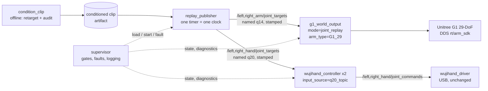
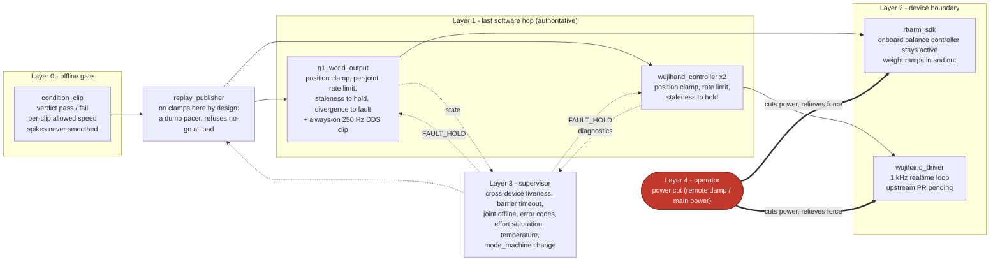

# Spec 1: hardware replay on the 29-DoF G1 (23-DoF secondary)

**Status:** proposed, 2026-08-27. Supersedes the 2026-08-26 question list.

Play a conditioned SignAR clip onto the real G1 arms over Unitree DDS and both
Wuji Hand 2 units over USB, on one clock, under an explicit safety envelope.
Not teleop; that is spec_2. `RobotSTAR_demos/TUITION.md` governs: its sections
3, 4, 5, 7, 8, 9, 10 are requirements on this design, cited below as §N.

The rig's robot is the **29-DoF G1** (waist yaw/roll/pitch, 7-DoF arms). The
**23-DoF** variant (waist yaw only, 5-DoF arms) stays a supported secondary
target. Decided 2026-08-27; hardware_spec.md carries the dated record.

## Pipeline and where each piece is specified

One offline stage conditions a clip; one publisher paces both devices from one
timer; each device node owns its own bus and its own final clamps. No new
runtime nodes on the data path: `joint_replay` and `q20_topic` are modes on
the device nodes that already exist.



Dashed edges are supervision, not the data path: the devices stay safe with
the supervisor dead ([safety envelope](#safety-envelope-where-it-lives)).

| Piece | What it does | Specified in |
|---|---|---|
| `condition_clip` | bundle sample to audited artifact; retarget, retime, verdict | [component 1](#1-condition_clip-new-offline-replay-package) |
| `replay_publisher` | paces both target streams from one timer | [component 2](#2-replay_publisher-modified), [one clock](#one-clock) |
| `g1_world_output` | arm interpolation, safety chain, DDS slot policy, device FSM | [component 3](#3-g1_world_output-modified) |
| `wujihand_controller` | hand q20 interpolation, clamps, diagnostics watchdog | [component 4](#4-wujihand_controller-q20-branch-modified-controller-package) |
| `wujihand_driver` | USB endpoint, unchanged; upstream PR pending | [component 5](#5-wujihand_driver-no-fork-now) |
| supervisor | load gates, alignment barrier, fault latch, bag | [component 6](#6-supervisor-new-node-replay-package), [run state machine](#run-state-machine) |
| what runs when | staged bring-up A to F, with gates | [bring-up](#bring-up-staged-against-7) |
| what stops it | four safety layers and their owners | [safety envelope](#safety-envelope-where-it-lives) |
| what it records | §10 logs and the §11 return package | [logging](#logging-10-and-return-package-11) |
| what is not buildable yet | adapter, identities, limits, branch flips | [hard blockers](#hard-blockers) |

## Measured facts

These replace the 2026-08-26 draft's facts. All were recomputed from the bundle
on 2026-08-27; the commands live with the audit tooling (section: conditioning).

1. **Waist does not move.** Columns 12/13/14 of `body_q` (waist yaw/roll/pitch,
   matched by name) are 0.0 in every frame of all 30 trajectories (15 samples,
   GT and Ours). The earlier claim that "arms plus waist yaw" moves is wrong.
   Legs are frozen at a stand pose. What moves is 14 arm joints.
2. **The npz velocity column understates the truth.** Finite differences of
   `body_q` at 50 fps give a peak of 161.4 rad/s on sample 02 GT where the
   `body_dq` column reports 96.2 (about 1.7x low). Use position differences for
   every rate decision; never trust `body_dq`.
3. **No clip is speed-safe, and the failures split in two.** Sustained speed
   (p99.5 of |dq|) runs 7.8 to 17.2 rad/s across the 30 trajectories: time
   redistribution fixes this. On top of that sit isolated single-frame spikes,
   up to 3.23 rad in one 20 ms frame (samples 01, 02, 03, 14, 15 at minimum),
   consistent with IK wrist-branch flips. §7 Stage E is explicit that slowing
   down does not fix branch flips: those clips stop at the gate until the
   trajectories are regenerated upstream, or run with wrists excluded.
4. Every sample ships `real_robot_ready: false` and `diagnostic_only: true`.
   Sample 01 is banned as a first clip (§7F: 142.6 N shoulder-torso contact in
   the bundle's own physical audit).
5. Hand columns `left_q`/`right_q` in `controller_reference_v7.npz` are legacy
   Wuji solutions and must never reach Hand 2 (§2.1). Hand 2 angles are
   regenerated from `hand2_input/*_human_targets_v5.npz` keypoints (§3.1).

## Current state (af7ee14)

Commit af7ee14 ("Bugfix & Migration") replaced the retargeting hand model: the
optimizer was fitting Wuji Hand 1 geometry while commanding Hand 2. It bumps
the `wuji-retargeting` pin to v2026.8.17, ships the official Hand 2 Beta 2
URDFs, adds the root-frame correction, and remaps qpos to device order. Detail,
including the 30-clip diff §3.1 asks for, is under
[component 1](#1-condition_clip-new-offline-replay-package). This clears the
model half of hard blocker 2.

Commit aae4638 ("Unstable & Untested Integration") landed the G1_29 DDS
control MVP: `G1ArmController(arm_type)`
drives either variant over `rt/arm_sdk` or `rt/lowcmd` (250 Hz write thread,
CRC, weight at slot 29, writer lockfile), and `arm_type` defaults to `G1_29`.
Pose IK stays G1_23-only; joint_replay needs no IK. The commit message itself
records that no safety envelope exists yet (§5/§8/§9/§10 pending). Two
leftovers from that commit are work items here:

- The comment above `G1_29_ARM_JOINT_NAMES` (`robot_arm.py`, ~164) still says
  the 29 DDS controller does not exist. Stale; fix with the next code change.
- The init loop still writes all 35 motor slots with `mode = 1` and hold gains
  (kp 300 / kd 5 on non-arm slots). On the 29 that actively commands real waist
  roll/pitch (13/14) and the legs through arm_sdk. Replaced by the slot policy
  below.

The rest of the sim replay path works as documented in usage.md Flow 3:
`replay_publisher` paces one clip from one timer; `g1_world_output` in
`joint_replay` consumes arm targets by name; two `wujihand_controller` nodes
retarget keypoints live; MuJoCo mirrors the four `joint_commands` topics.
Known defects this spec fixes:

- `_SideBuffer.interpolate()` keys on arrival time, so alpha always clamps to
  1 under the single-threaded executor: the output is a zero-order hold at the
  publish rate, exactly the 50 fps stepping §5 forbids. Its docstrings describe
  interpolation and a ramp that never occur; both get fixed with the code.
- The 250 Hz DDS velocity clip (20 rad/s, uniform scaling) is skipped entirely
  when `simulation_mode` is true, and there is no position clamp, staleness
  watchdog, or stop hook anywhere in the replay path.
- The live hand path never calls `Retargeter.reset()`, so filter and warm-start
  state leak across clips (§3.1 requires a reset per clip).
- `ChannelFactoryInitialize(domain)` is called without a network interface. The
  Unitree SDK builds its own CycloneDDS config and ignores `CYCLONEDDS_URI`, so
  on a multi-NIC host the env var cannot pin the robot link.
- `wujihand_driver` clamps nothing (its limit parameters are 0 to 1.57
  placeholders), has no command watchdog, and its **named** command path
  zero-fills any joint whose name does not match: a named JointState against
  the unpatched driver is more dangerous than the unnamed full-20 arrays the
  teleop path sends. `wujihandros2` is a pinned upstream submodule.

## Components

Three existing seams stay where they are: input (`replay`), controllers, and
device writers (`g1_world_output` for DDS, `wujihand_driver` for USB). Two
additions: an offline conditioning stage and one supervisor node. Rationale:
each device writer must be safe standalone (stale input means hold, never
zero), so safety never depends on the supervisor being alive; final clamps
belong at the last hop before each bus; replay stays a dumb pacer.

Sim compatibility is at the `joint_commands` level: `mujoco_visualizer`
subscribes the four `/{left,right}_{arm,hand}/joint_commands` topics, and both
the teleop path and this replay path produce them. The hardware replay pipeline
does **not** publish `keypoints21`; that topic is teleop-only. Flow 3's live
keypoint replay remains as a legacy sim path until the artifact flow below
replaces it.

### 1. `condition_clip` (new; offline; replay package)

Turns one bundle sample (GT or Ours) into a **conditioned clip artifact**. Runs
in the teleop container. Deterministic: same inputs, same output hashes.

Arms:
- Extract the 14 arm joints from `body_q` by name (waist is measured zero; see
  the waist paragraph below).
- Audit with position finite differences against a curated deploy-limits YAML
  (`g1_deploy_limits.yaml`). The file carries **two distinct kinds of row, and
  must not conflate them**: the hardware ceiling, which is sourced, and the
  deployment cap, which is our choice and is not.

  **Hardware ceilings are sourced, per joint, for position, velocity and
  torque.** They are Unitree's published `<limit>` values from
  `g1_29dof_rev_1_0.urdf` in `unitreerobotics/unitree_ros`, which
  `scripts/fetch_g1_description.sh` already pulls and `g1_29_wuji2.urdf`
  already carries. Verified against upstream on 2026-08-28:

  | joint group | position (rad) | velocity (rad/s) | effort (N·m) |
  |---|---|---|---|
  | shoulder pitch/roll/yaw, elbow | see URDF, per joint | 37 | 25 |
  | wrist roll | ±1.9722 | 37 | 25 |
  | **wrist pitch, wrist yaw** | ±1.6144 | **22** | **5** |
  | waist yaw | ±2.618 | 32 | 88 |
  | waist roll, waist pitch | ±0.52 | 30 | 35 |

  Wrist pitch and yaw are the weak pair: 5 N·m, a fifth of every other arm
  joint. Any torque audit must be per joint, not a single global cap, or it
  will pass a wrist load that the wrist cannot hold.

  **What is still unsourced is acceleration**, which URDFs do not carry, and
  the **deployment** cap. §6 requires official deployment limits recorded on
  the rig before the first run, and a 37 rad/s actuator ceiling is a design
  rating, not a safe replay speed. So the file keeps a provisional deploy
  block pinned to the bundle's conservative screening pair (0.5 rad/s,
  3.0 rad/s²), commented provisional-until-§6, layered under the sourced
  ceilings. The ceiling rows are asserted always; the deploy rows are what
  Stage A replaces.

  This sharpens measured fact 3. Sustained p99.5 speed of 7.8 to 17.2 rad/s is
  **under** the 37 rad/s hardware ceiling, so retiming those clips is a safety
  choice, not a hardware necessity. The single-frame spikes are not: 161.4
  rad/s on sample 02 GT is **4.4x the ceiling**, and 7.3x for a wrist
  pitch/yaw joint at 22. Branch flips are a hard violation of a sourced limit,
  which is why §7E is right that slowing down does not fix them.
- Sustained overspeed gets integer time redistribution `k` (same mechanism as
  the bundle's own retiming: waypoints untouched, §7E compliant), capped at a
  configured maximum.
- Spikes and branch flips are never smoothed. They go into the audit and drive
  the verdict: `pass` or `fail`. The full audit numbers land in the JSON
  either way, so a clip whose numbers make an operator want a kinematic
  preview gets one on the operator's judgment; that does not need a third
  machine-readable tier.

Hands:
- Per side: `Retargeter.from_yaml(...)`, then `reset()` (§3.1), then step all
  source-rate keypoint frames to q20. PCHIP-retime q20 onto the arm frame grid
  so both devices share one timeline. Audit against a hand-limits YAML (values
  from the hand URDF, e.g. r_thumb_cmc_flex [-1.187, 1.291], velocity 8.587).
  See the §6 hand-limit deviation below before trusting those numbers.
- **Named deviation from §6 (hand limits).** The hand-limits YAML above is
  read from `src/wujihand_urdf/wujihand_{left,right}.urdf`, now the official
  `wujihand2-beta2-{side}` vendor file (see the §3.1 note below). It is still a
  simulation model, and §6 forbids substituting a description package's limits
  for official hardware limits. Its thumb velocity of 8.587 rad/s is 2.1x the
  4.0 rad/s the bundle itself used as a conservative hand screening figure.
  Until Stage A records official Hand 2 limits: clamp hand velocity at
  4.0 rad/s, not the URDF value, and add an **effort** clamp to the hand chain
  (position and rate only is not enough). Per-joint effort limits are already
  available from the hardware at runtime, published by the driver in
  `hand_diagnostics.effort_limits`
  (`wujihand_driver_node.cpp:309`), so this costs a subscription, not a
  measurement campaign.
- **The driver's placeholder limits are indexed onto the wrong joint.**
  `wujihand_driver_node.cpp:157-162` writes the abduction pair [-0.5, 0.5] at
  `abd_idx = f * JOINTS_PER_FINGER`, that is position **0** of each finger. On
  both Hand 1 and Hand 2, position 0 is **flexion** and position 1 is
  abduction (each hand's position-0 joint axis is parallel to its PIP and DIP
  axes; position 1 is perpendicular). So the parameters advertise flexion as
  [-0.5, 0.5] rad, a third of its real travel, and abduction as [0, 1.57],
  which is both one-sided and 2.2x Hand 2's published ±0.698. Nothing is
  actually clamped by these values (they are only written into ROS parameters
  at lines 183-186, never applied to a command), so this is latent, not an
  active fault. It matters twice: anything that reads those parameters as
  ground truth gets a wrong picture, and the upstream `wujihand_driver` PR
  listed in [out of scope](#out-of-scope) adds real clamps, at which point the
  mis-indexing becomes an active fault. Fix the index in that PR.
  Note also that the earlier "35% wider than the published limit" reading of
  this placeholder was measured against Hand 1 (`±0.37` in the
  `wuji-description` Hand 1 URDF; the retired `wujihand_urdf` Hand 1 pair said
  `±0.495`). Hand 2 Beta 2 publishes `±0.698` for every non-thumb MCP
  abduction, so against the hardware this campaign drives, ±0.5 is 28%
  **narrower**, not wider. The conservative direction, but for the wrong joint.
- **Named deviation from §3.1.** TUITION and the handoff README specify the
  official SDK `RetargetSession` with `HandModel.WujiHand2`. Neither symbol
  exists **in this repo**, but both exist upstream: `RetargetSession`
  (Python and C, `wuji_retarget_session_create/_step/_reset/_free`) shipped in
  wuji-sdk **v2026.7.21**, documented as mapping 21 MediaPipe-order keypoints
  to 20 joint angles in firmware order. Our `wuji-retargeting` submodule was
  pinned at **v2026.6.10**, about six weeks earlier, and is now at
  **v2026.8.17** for the model fix below.

  That bump does **not** close this deviation. `RetargetSession` ships in
  wuji-**sdk**, a separate dependency; wuji-retargeting v2026.8.17 does not
  contain the symbol, and the image's shim `setup.py` strips `wuji-sdk` from
  `install_requires`. We still run our own optimizer, not the official session.

  **The model half of this action item is done** (commit af7ee14). What it was
  and what it now is:

  - The vendored description tree held only `hand/` and `glove/`, so the
    optimizer was fitting **Wuji Hand 1** geometry and commanding Hand 2. Not a
    version-label nit: the index MCP segment differs by 23.1 mm, and the MCP
    abduction segment by 9.9 mm at a 3.2x ratio.
  - `src/wujihand_urdf/` now holds the official `wujihand2-beta2-{side}` files,
    byte-identical to `wuji-description` v2026.8.19 (SHA-256 recorded in that
    package's README); the Hand 1 pair moved to `deprecated/`.
  - The `wuji-retargeting` pin moved v2026.6.10 to **v2026.8.17**, which adds
    `optimizer.link_naming` (Hand 2's anatomical link names) and resolves the
    PIP/DIP qpos indices from the kinematic chain instead of hardcoding them.
    Verified behavior-neutral on the old path: **bitwise identical** q20 across
    all 60 trajectories.
  - Two defects that a URDF swap alone would have shipped, both now fixed:
    Hand 2's root frame is rotated **178.45°** from Hand 1's, so without the
    `mediapipe_rotation` correction the mean optimizer residual goes 5.42 to
    136.63; and Pinocchio orders Hand 2's joints `index, middle, pinky, ring,
    thumb` (urdfdom sorts children by link name, and Hand 1's `finger1..5`
    happen to sort into declaration order), so raw q20 would have sent thumb
    angles to the index finger. `wujihand_controller` now remaps qpos to URDF
    declaration order and raises rather than falling back to identity.
  - **§2.2's revision question no longer gates the retarget model.** Beta 1 and
    Beta 2 were diffed joint by joint: all 25 common joints carry identical
    origin xyz and rpy (max difference 0.000e+00), same names, order and
    limits; Beta 2 adds only 5 fixed sensor-pad frames. IK output is identical
    on either revision. Beta 2 is shipped because it matches
    `g1_wuji2_description` and the firmware v2.0.0 line, not because the
    numbers differ. The revision still gates **firmware**, so blocker 2 stands
    for that reason alone.

  **§3.1 diff, all 30 clips, both hands** (15 samples x GT/Ours, 9920 frames),
  old pipeline to shipping config, per §3.1's "diff before any hand hardware
  run":

  | scope | max \|Δq\| (rad) | RMS Δq (rad) |
  |---|---|---|
  | all 20 joints | 2.5056 | 0.3649 |
  | worst joint (pinky_dip) | 2.5056 | 0.7268 |
  | best joint (middle_pip) | 0.4763 | 0.0896 |

  The pinky dominates because that is where the two hands differ most: PIP
  43.9 to 33.6 mm, a 23% shortening. Fit quality is unchanged to slightly
  better (mean residual 5.422 to 5.211), which is the expected result: both are
  20-DoF anthropomorphic hands, so the optimizer fits the human keypoints about
  as well either way. The point is not that the residual drops, it is that q20
  now means something on Hand 2. All 9920 frames are finite and inside Hand 2's
  limits to 1e-7 rad.

  The substitution, the pin, and the config hash are still recorded in
  `hand2_retarget_meta.json`. Note that even upstream's Hand 2 kp/kv gains are
  provisional: the release notes say they are carried over from Hand 1
  calibration pending system identification on Hand 2 hardware.

  **Still open:** adopt `RetargetSession` with `HandModel.WujiHand2` (needs the
  wuji-sdk dependency in the image), and re-derive the glove configs'
  `segment_scaling` against Hand 2. Those pinky values were fitted against Hand
  1's longer pinky and are flagged in place, not retuned, because retuning
  needs glove hardware.

Artifact:
- `conditioned_clip_v1.npz`: arm q [T,14] + names, left/right q20 [T,20] on the
  arm grid, fps, k.
- `conditioned_clip_v1.json`: input sha256s checked against `MANIFEST.sha256`,
  retargeter submodule commit + config hash + hand model id, limits used and
  their sources, the full audit, the verdict, and first/last frame poses (for
  approach and park planning).
- This satisfies the §3.1 metadata list and is §11 item 6 (the q20
  trajectories to return) by construction.

### 2. `replay_publisher` (modified)

- Consumes artifacts (`--clip`); refuses `fail` verdicts on hardware profiles
  (`--force-sim` exists for simulation only).
- Service-gated: `load` (String JSON request: artifact path, speed_scale, arm
  sides), `publish_first` (repeat frame 0, do not advance), `start`. Publishes
  nothing on spin. **No pause and no mid-clip resume**: §9 forbids continuing
  after an abnormal event, so a faulted run is parked, inspected, and rerun
  from the start.
- Publishes both devices' target streams: arm q14 on
  `/left,right_arm/joint_targets` and hand q20 on
  `/left,right_hand/joint_targets` (named, stamped), all from the one timer.
  keypoints21 is not part of this pipeline. One source pacing both devices
  makes arms and hands play the same clip by construction; no cross-check
  handshake is needed.
- Stamps tick i with `t0 + i * dt_play`, where `dt_play = k / (target_fps *
  speed_scale)`. `speed_scale` is time redistribution only, layered on the
  baked k. No side-channel transport topic: the device nodes need the stamps,
  and the artifact hash lives in `run_manifest.json`.
- Per-side and per-device scope for §7C runs is part of the `load` request:
  the publisher publishes only the in-scope target topics.

### 3. `g1_world_output` (modified)

**LowCmd slot policy** (pinned; today's write-all-35 behavior is replaced):

- `rt/arm_sdk`: write slots 15 to 28 (arms) and 29 (weight). Nothing else.
  Slots 0 to 14 and 30 to 34 are never written; they stay at constructor
  defaults (kp = kd = 0, inert). Per-motor `mode` is not set (the vendor arm7
  example never sets it). `mode_machine` is copied from lowstate; `mode_pr` is
  0. The waist is uncommanded, so by the same rule it is not written: holding
  it at kp 300 would put our position loop in contention with the balance
  controller §2.3 assigns it to. Stage A confirms on the real firmware that
  arm_sdk holds the waist with its slots unwritten; if it does not, the write
  returns as a one-line exception with a recorded reason.
- `rt/lowcmd`: not used by this design. It requires releasing the onboard
  controller and owning all 29 motors every cycle, a suspended-robot regime.
  Documented so nobody discovers the difference on hardware.

**Waist.** Measured zero in every clip, and the owner decision is to skip
commanding it. Its slots are left unwritten under the slot policy above.
`/waist/joint_targets` is reserved as the topic name for a future clip set that
moves the waist; nothing publishes or subscribes it today.

**ZOH fix.** `_SideBuffer` keeps its shape; `interpolate()` changes to
interpolate from the currently commanded value toward the newest sample over
one inter-arrival period (about 10 lines). Costs 20 ms of latency, irrelevant
open-loop. Stage 0 asserts the command stream is piecewise-linear. Docstrings
fixed in the same change.

**Safety chain** (new `replay_safety.py`, pure numpy, unit-testable without
ROS): position clamp (curated limits, margin parameter), per-joint rate limit
(uniform scaling, preserves path direction), staleness tracker (stale input
means hold last command), divergence monitor (|measured - last command| above
threshold for M consecutive ticks raises a fault). Runs in the joint_replay
loop. The 250 Hz DDS-thread clip becomes per-joint, parametric from the same
limits file, and **always on, simulation_mode included**. There is no
separate software-stop topic: `run_ctl stop` calls the supervisor's fault
Trigger, supervisor death is already covered by the staleness hold, and
force relief is the operator power cut (Layer 4). One operator stop path, not
three.

**Device state machine** (§8):

```
ready (hold measured)
  -> engage   weight 0 -> 1 over >= 2 s, commanding the measured pose;
              that pose is snapshotted as the release target
  -> approach measured -> frame 0 under approach limits;
              done when max error < 0.05 rad and measured dq ~ 0
  -> track    follow the stamped stream
  -> end_hold hold the last target; confirm dq ~ 0 for >= 1 s
  -> approach re-entered with target = snapshot (no separate park state)
  -> release  weight 1 -> 0 over >= 2 s while commanding the snapshot
```

**Entering engage is gated.** The snapshot is commanded truth for the whole
run and the target of the release slew, so `ready -> engage` requires N
consecutive lowstate frames inside the staleness bound with measured |dq|
below a threshold. A snapshot taken from a 200 ms-old frame, or while the arm
is still settling, would be wrong for the entire run. About five lines, and it
removes a silent single point of failure from the two states that touch the
robot hardest.

**Losing power or lowstate resets the machine.** A power-cut event, or any
lowstate gap beyond the staleness bound while in a powered state, forces the
node back to `ready`: discard the snapshot, treat the weight as unknown,
require a fresh engage from measured. Without this rule a node that comes back
believing weight is 1 with a stale target snaps a drooped arm to that target,
which is the discontinuity §8 forbids arriving by a path nothing else in the
design covers. What a power cut actually does to the write path and to lowstate
is a named Stage A deliverable, recorded beside §6's "power-cut behavior" field.

Release happens at the snapshot because that is the pose the onboard
controller was itself maintaining at engage; it minimizes the takeover jump.
Fault in any powered state: hold the last safe command at the current weight;
never zero a command, never auto-release (§8, §9). **Fault mid-engage: freeze
the weight at its current ramp value** and keep commanding the measured pose;
de-escalation is operator-only.

**Read-only mode** (`--read-only`): subscribe lowstate, never start the write
thread, never touch the weight. Required for §7A; today the constructor
immediately position-holds and enables the weight, which makes Stage A
impossible.

**New publications** (for §10): `velocity` and `effort` filled in the arm
`joint_states`; `/g1/imu` (sensor_msgs/Imu); `/g1/status` (String JSON:
mode_machine, tick, lowstate age, max motor temperature, voltage).

**Network.** New `network_interface` parameter threaded to
`ChannelFactoryInitialize(domain, iface)`. YAML and README note that
`CYCLONEDDS_URI` governs only the ROS graph; this parameter is the only way to
pin the Unitree participant's NIC. The docker cyclonedds.xml peer config is
validated same-host only; a separate-host G1 is untested topology.

**Gains** move from hardcoded constants to a `gains:` table in `g1_robot.yaml`:
today's tiers (shoulders/elbows 140/3, wrists 50/2, hold 300/5) as default, the vendor example's uniform 60/1.5 as a selectable
fallback profile. Retuning becomes a config change, validated in Stage B.

### 4. `wujihand_controller` q20 branch (modified; controller package)

No new node. The hand side mirrors the arm side's answer to the same
problem: `g1_world_output` gained `joint_replay` as a mode, so
`wujihand_node` gains a third `input_source` value, `q20_topic`, beside
`wuji_glove` and `keypoints_topic`. The node keeps sole ownership of
`/{hand}/joint_commands` in every mode, so a replay/teleop double-writer is
structurally impossible and the launch-profile discipline a separate
streamer node would need disappears. This branch is the §5 implementation.
Per hand:

- Subscribes `/{hand_name}/joint_targets` (named q20, stamped by the
  publisher). The retargeter is not constructed in this branch
  (`enable_ik=False`), so replay never pays for or depends on NLopt.
- Fixed-rate loop on the existing `control_rate` parameter, raised to 200 Hz
  for replay (§5 range is 200 Hz to 1 kHz; final rate decided on-site);
  interpolates between the two most recent stamped targets with the same
  interpolate-toward-newest scheme as the arm ZOH fix; clamps position,
  rate, and effort against the hand limits (see the §6 hand-limit deviation);
  runs its own approach phase. Its state machine is four states, not the arm's
  seven: hold, approach, track, end_hold. Engage, park, and release exist only
  to manage the `rt/arm_sdk` weight, and the hand has no weight and no onboard
  controller to hand back to.
- **Publishes unnamed full-20 arrays in driver order** every cycle. Named
  publishing is forbidden until the driver's named-path zero-fill is fixed
  upstream. A preflight assert refuses to run on mismatch, recorded in
  `joint_mapping.json`.

  What the assert has to establish: we publish 20 bare numbers, and the driver
  reads element `i` as finger `i / 4`, joint `i % 4`
  (`wujihand_driver_node.cpp:407-408`). Nothing carries meaning across that
  boundary except position. So the only question is whether **our element `i`
  and the driver's element `i` are the same physical joint.**

  **It cannot be a name comparison,** which is what the earlier draft assumed.
  The driver names its joints `finger{1..5}_joint{1..4}`
  (`wujihand_driver_node.cpp:22-26`); since af7ee14 our URDF names them
  `r_thumb_cmc_flex` and so on. Both name the same 20 joints in the same order,
  but no string is shared, so `set(ours) == set(theirs)` fails on a **correct**
  system. An assert that fires when everything is right gets deleted, and then
  nothing is checked.

  Split it by what is actually knowable:

  - **Offline, in software:** 20 elements; 5 groups of 4; our order is URDF
    declaration order, thumb to pinky. `_build_qpos_perm` establishes this by
    construction and it is verified 20/20 per side against the MuJoCo actuator
    mapping. Record both name lists side by side in `joint_mapping.json` so the
    intended correspondence is written down rather than assumed.
  - **Stage A, physically:** that the driver's `finger1` really is the thumb.
    This is a firmware fact; no amount of software agrees or disagrees with it.
    The repo asserts it in the `HAND_CODES` comment, and that is an assumption,
    not evidence. Confirm it the same way §7A already confirms left from right:
    command one distinguishable joint on the finger you believe is the thumb
    and watch which finger moves. Thirty seconds, and it is the only step that
    catches an off-by-one across all five fingers.
- **Named deviation from §5.** The driver consumes position only; velocity
  and effort in commands are ignored end to end. The branch therefore
  publishes position-only rather than implying a contract the driver does
  not honor. The wujihandcpp realtime layer (1 kHz loop, 10 Hz low-pass) is
  the fixed-frequency execution §5 asks for; feedback is read via
  `joint_states` (1 kHz) and `hand_diagnostics` (10 Hz).
- Subscribes `joint_states` and `hand_diagnostics`: state staleness, any
  nonzero `error_codes[i]`, joint offline, or over-temperature means hold
  last command and raise a fault.

The `wuji_glove` and `keypoints_topic` branches keep their existing structure,
but af7ee14 changed what they load: both now retarget against the Hand 2 URDF
with `optimizer.link_naming`, carry the root-frame `mediapipe_rotation`, and go
through the qpos remap. `keypoints_topic` also split per side, because
`urdf_path` and `link_naming.prefix` are side-specific and the optimizer has no
`{side}` token; `_resolve_retarget_config` already preferred the per-side name,
so that needed no code change. The `q20_topic` branch here is unaffected: it
constructs no retargeter.

### 5. `wujihand_driver`: no fork now

The zero-fill hazard cannot trigger on unnamed full-20 commands, and patching a
pinned submodule does not fit the bind-mounted workspace. Plan: file the
upstream PR (named-path zero-fill fix, clamp to real URDF limits, **fix the
placeholder abduction limits being indexed onto the flexion joint**,
command-age diagnostic, observe mode); rely on the preflight contract assert
and the q20 branch's clamps meanwhile; fork and repoint `.gitmodules` only if
upstream declines.

### 6. Supervisor (new node; replay package)

One node, no new interface package: std_msgs/String JSON plus std_srvs/Trigger
cover the whole surface, which keeps interface builds out of the containers and
lets logs be read anywhere without message definitions. It owns the run state
machine, the load-time gates, one cross-device "all aligned" barrier, the
operator start, and a latched fault. Beside it, an operator CLI (`run_ctl`)
and two scripts: `choose_first_clip.py` (scans the 30 audit JSONs for the §7F
first-clip criteria) and `make_artifacts.py` (post-run, offline). Two things
deliberately are **not** tools. Stage B's single-joint tests emit a tiny
conditioned-clip artifact (slow ramp on one joint, everything else at
measured) and load through the same `load`/`start` path as a real clip, so
the supervisor grows no second motion interface and Stage B validates the
path Stage C depends on. And `hardware_manifest.json` ships as a template
with §6's checklist as empty fields: most of its items (revision, serials,
mount model, power-cut behavior) are human observations, so it is a form the
operator fills in Stage A, not a collector to build and keep in sync.

## Run state machine

Device state machines (above) carry §8. The run level is deliberately four
states: the §7 checks are preconditions on transitions, not resident states,
and device state is reported as fields in `/run/status` rather than mirrored.

```
IDLE -> ARMED -> RUNNING -> IDLE
                    |
   any powered state -> FAULT (latched)
```

- **`load` preconditions** (§7D, §7F): artifact verdict is `pass`, joint names
  match the rig variant, requested speed is within the per-clip allowed scale,
  sample 01 refused as first clip, GT-before-Ours (loading Ours requires a
  passing GT `tracking_summary.json` at the same scope and scale, or an
  explicit override).
- **`arm` preconditions** (§7A preflight): lowstate fresh, mode_machine
  recorded (MotionSwitcher CheckMode), 20+20 hand joints online, zero error
  codes, sides physically confirmed (see below), hand name-order assert
  passed, comm soak clean, power-cut and watchdog behavior exercised. Operator
  signs the checklist. `arm` then runs each device's engage and approach.
- **`start`** waits on one condition, not a state: every in-scope device
  reporting frame-0 hold. Operator-issued. The only automatic exits from
  RUNNING are clip end and fault.
- **FAULT** (latched): devices freeze per their state machines (weight frozen
  at its current value if mid-engage), the publisher stops advancing,
  everything keeps streaming its hold command. No resume: operator inspects,
  parks, releases, and reruns from the start. Further loads are refused until
  an explicit operator clear-fault (§9: do not continue after an abnormal
  event).

**Sides physically confirmed.** Firmware handedness tells you which hand a
device *is*, not which arm it is bolted to, and both hands enumerate under the
same USB VID:PID. So the check is three parts: assert the driver-reported
handedness matches the topic namespace, record serial-to-side in
`joint_mapping.json`, and have the operator command one distinguishable joint
on the hand they believe is left and watch which physical hand moves. Only the
last part catches a mounting error, and it is thirty seconds of Stage A.

Every motion-initiating transition is an operator service call. Every stop is
automatic or operator. Solo operation: one launch terminal, one `run_ctl`
terminal, the power-cut path (remote damp / main power) within reach. This rig
has no dedicated hardware e-stop; the robot's remote damp command and main
power switch are the physical stop layer.

## Safety envelope: where it lives

Four layers, drawn over the same pipeline as above. The load-bearing property
is that Layer 1 lives **inside the device nodes**, not in a separate guard
process: the last software hop before each bus is the authoritative clamp, so
a clip keeps being safe when the publisher, the supervisor, or the network
dies. Every layer's failure response is hold, never zero (§8).



Reading the two diagrams together: Layers 0 and 3 are the boxes that only
appear in supervision (dashed above); Layers 1 and 2 are the same data-path
boxes as the pipeline diagram, carrying their own guards. Layer 4 reaches
every powered box directly.

Two things the drawing makes explicit. Layer 1 keeps holding safely with
every dashed edge cut, so no software stop needs a healthy supervisor. And
Layer 4 is the only layer that can *reduce* force: every software layer holds
position, which for a collision or effort-saturation fault sustains contact
until a human intervenes.

- **Layer 0, offline**: the conditioning gate. Cheapest place to stop a bad
  clip; produces the per-clip allowed speed.
- **Layer 1, last software hop** (authoritative): the arm safety chain plus the
  always-on per-joint DDS clip; the hand q20 branch's clamps, rate limit, and
  staleness hold. These act even if everything else dies: stale input means
  hold last command, never zero. This is why no software stop path needs the
  supervisor alive: cutting its edges leaves every device holding.
- **Layer 2, device boundary**: driver behavior as-is plus the upstream PR;
  on the arm side, `rt/arm_sdk` with the onboard balance controller active
  (§2.3) and the weight semantics above.
- **Layer 3, supervisor**: only what the supervisor alone can see. Divergence
  and per-device topic staleness stay at Layer 1, where they must act with the
  supervisor dead; duplicating them here would mean two thresholds that can
  disagree and two places to look when a fault fires. That leaves:
  cross-device liveness, the alignment-barrier timeout, hand joint offline and
  error codes, effort saturation for over 1 s, temperature warn and trip, and
  mode_machine change (cheap, unambiguous, and the signal that the onboard
  controller changed state under you). Response is always FAULT_HOLD. Named
  gap: no direct balance-alarm flag is exposed on lowstate, and collision
  detection is not a detector here at all, because effort saturation and
  divergence each already trip independently and a real collision trips both.
  Collision defense is §7 stage ordering and the operator's eyes.
- **Layer 4, physical**: the operator power cut — the robot's remote damp
  command or main power switch (no dedicated e-stop exists on this rig). It is
  **the designed force-relief
  path for collision and effort-saturation faults**, because the software
  response is a position hold by design (§8 forbids zeroing commands). A
  retarget-to-measured relief is a possible later addition, not in the first
  campaign.

## One clock

One publisher stamps both devices' target streams from one timeline
(t0 + i * dt_play). The arm node and both hand nodes interpolate their
stamped streams the same way. All processes run on one host, so one ROS clock. §10's unified
monotonic timestamps are the bag's receive times, with the lowstate tick
recorded in `/g1/status` for a DDS-side cross-check.

## Logging (§10) and return package (§11)

rosbag2 (mcap), spawned by the supervisor at load, stopped at release.
Allowlist: arm `joint_targets`/`joint_commands`/`joint_states`, hand
`joint_commands`/`joint_states`/`hand_diagnostics`, `/g1/imu`, `/g1/status`,
`/replay/status`, `/run/{status,events,fault}`, `/rosout`. keypoints21 is
teleop-only and not recorded here.

Run directory `~/wuji_runs/<UTC>_<sample>_<method>_<scale>_<scope>/`:

```
run_manifest.json      clip, method, scale, scope, git SHA, image digests,
                       operator, threshold profile
bag/                   mcap
events.jsonl           live-written by the supervisor, severity field
                       (survives bag loss)
fault_log.jsonl        post-run, the filtered view of events (§10)
command_vs_actual.npz  post-run, make_artifacts.py           (§10)
tracking_summary.json  per-joint RMSE, max error, lag, pass/fail.
                       Proposed pass criteria, unratified: zero faults,
                       arm RMSE <= 0.15 rad and max error <= 0.35 rad,
                       hand RMSE <= 0.15 rad, all comm ages inside
                       watchdog bounds for the full clip
real_run.mp4           operator camera; a start-marker event syncs it
```

Manifests: `hardware_manifest.json` (Stage A: driver read-only params, lowstate
identity, §6 checklist), `joint_mapping.json` (name tables plus the hand
name-order assert), `hand2_retarget_meta.json` (from artifact provenance),
`mount_transform.yaml` (blocked on the adapter). §11 items 1 to 11 map onto
these plus the run directories; item 11 (samples safe at 0.5x and 1.0x) may
legitimately come back empty, which is a data property, not a tooling gap.

## Bring-up, staged against §7

Until the mount adapter exists the hands cannot ride the arms, so stages A to C
run as two independent tracks in parallel: the **arm track** (G1 on the rig)
and the **hand track** (both hands benchtop on the rig host). Combined runs
(C step 6, combined D/E, all of F) are blocked on the adapter.

| Stage | Gate in | Work | Gate out |
|---|---|---|---|
| 0: all-sim (runnable now) | none | `replay_sim.launch.py` collapses the manual terminals; conditioning over all 30 clips (verdict table); full state-machine traversal; fault drills (kill publisher mid-run, inject stale input and a frame jump); **the hand q20 branch drives the MuJoCo hand model** via its joint_commands; assert arm commands piecewise-linear; §3.3 visual comparison against the bundle reference videos | CI smoke green; artifacts generate and validate |
| A: read-only (§7A) | rig host wired; power-cut path (remote damp / main power) identified | arm `--read-only`; hand track per the §7A limitation below; fill `hardware_manifest.json` from the template; 10 min comm soak; power cut and watchdog physically tested, with their software-side effect recorded | signed §7A checklist; `hardware_manifest.json`, `joint_mapping.json` |
| B: single joint, supported (§7B) | A passed; G1 suspended or supported | single-joint artifacts through the normal load path: all 20+20 hand joints, then each arm joint; verify index, sign, zero, feedback agreement, current, temperature; verify the arm_sdk slot policy (legs and waist unaffected); gain tuning | `stage_b_report.json` per device |
| C: separate (§7C) | B passed on that track; first clip from `choose_first_clip.py` (01 excluded) | order: hands-left, hands-right, arms-left, arms-right, arms-both; step 6 combined is blocked on the adapter | scoped `tracking_summary.json` in bounds, zero faults, operator sign-off |
| D: GT before Ours (§7D) | C scoped passes | enforced by the load gate, per track before the adapter, combined after | GT passing before any Ours, per sample |
| E: slow then normal (§7E) | D passing at the current rung | ladder 0.25x, 0.5x, 1.0x; each rung capped by the per-clip allowed scale (FD peaks vs deploy limits); time redistribution only | §11 item 11 list. Arithmetic: sustained 7.8 to 17.2 rad/s against 3 to 6 rad/s proposed limits gives k of 2 to 6; spike clips stay wrist no-gos until regenerated |
| F: contact last (§7F) | E passed for non-contact clips; adapter installed; C6 done | contact clips identified from the physical audits; sample 01 only after a fresh audit clears the 142.6 N contact | full §11 return package |

## DoF variant policy

`arm_type: "G1_29"` is the default (aae4638) and the bundle replays as
recorded: 14 arm joints, wrist pitch/yaw included (rms 0.88 rad in the data,
so this content matters). A 23-DoF rig should work with no extra plumbing,
because every hop matches joints by name and the arm node warns-and-ignores
names its table lacks, but that path is untested and out of scope for this
campaign; wrist pitch/yaw content would be dropped. Both composed models
(`g1_29_wuji2*`, `g1_23_wuji2*`) stay in `g1_wuji2_description` for the §4
revalidation once the real mount transform is measured.

## Hard blockers

1. **Mount adapter unconfirmed** (the vendor STL is a Hand v1 part). Since
   2026-08-29 both composed models mount the hands through a
   `{left,right}_hand_dock` link (`meshes/g1-hand-dock.stl`, hand mount 3.75 mm
   beyond the flange, so no longer zero plate thickness), but whether that mesh
   is a real adapter's CAD or a modelling placeholder is unrecorded, and no
   dimension of it has been measured against a physical part. The blocker
   stands on that answer: combined stages and the §4 flange-transform
   measurement stay blocked until an adapter physically exists and its
   transform is measured. Model details:
   [hardware_spec.md](hardware_spec.md#mounting-adapter-modelled-cad-provenance-unconfirmed).
2. **Hand 2 serials and firmware unconfirmed** (§2.2). Blocks hand hardware
   stages beyond A. No longer blocks the retarget model: Beta 1 and Beta 2 are
   kinematically identical, so the shipped Beta 2 URDF is correct either way
   (§3.1 note). The revision still decides the firmware line, since v2.0.0
   targets Beta 2 and Beta 1 does not receive it.
3. **G1 identity unrecorded** (firmware, SDK commit, onboard mode hosting
   arm_sdk; §6). Gate for any DDS write; waist-hold-under-arm_sdk behavior
   unverified on this firmware.
4. **Wrist branch flips** in several clips need upstream regeneration or a
   per-clip wrist no-go; a decision with the trajectory authors.
5. **Official deployment limits and acceleration limits unrecorded** (§6);
   screening-derived values govern until then, and 1.0x may be unreachable for
   spiky clips. Narrowed 2026-08-28: per-joint position, velocity and torque
   **ceilings** are sourced from Unitree's published URDF and already vendored
   (component 1). What is missing is the deployment cap, which is a rig
   decision, and acceleration, which no URDF carries.

## Out of scope

Teleop (spec_2), the camera pipeline (operator camera covers `real_run.mp4`),
any change to the balance or whole-body controller, pause/resume, waist
command mode, the 23-DoF hardware path, monitor GUI changes, and any
effort/temperature guard on the hand end-of-run pose (position-controlled
replay does not load the servos enough to warrant it; the hands slew to a
neutral pose at clip end under approach limits, per §8's "return smoothly to
a safe pose"). The upstream
`wujihand_driver` PR (named-path zero-fill, real clamps, command-age
diagnostic, observe mode) is out-of-band work: the design does not depend on
it, since unnamed full-20 commands cannot trip the zero-fill.
