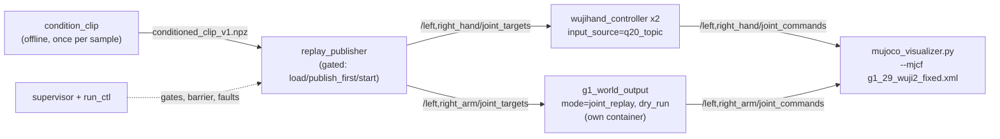

# Developer Usage Reference

Daily commands for working on this repo. Assumes the one-time setup in
[Install](../README.md#install) is done: image built,
serials configured, container able to start.

Audience: a developer editing code. For first-time setup, use the
[main README](../README.md). For per-device operator setup (PICO,
trackers), see the [guides index](README.md).

- [Where commands run](#where-commands-run): host vs. container.
- [Container lifecycle](#container-lifecycle): start, enter, stop, destroy, logs.
- [Build and test](#build-and-test): colcon and pytest inside the container.
- [Launch](#launch): Monitor GUI, raw launch files, sim modes.
- [SOT bundle replay (sim)](#sot-bundle-replay-sim): replaying a recorded sample in MuJoCo.
- [Hardware replay](#hardware-replay): operator flow, checklist, and staged bring-up for the real rig. Arm track validated on hardware 2026-09-01 (Stages A-C); hand track and combined stages pending.
- [Verify](#verify): the topic rates that prove the pipeline is up.
- [Which change needs which rebuild](#which-change-needs-which-rebuild): edit-to-action map.

## Where commands run

`docker compose` commands run **on the host**, from `docker/`. Everything else
(`colcon`, `ros2`, `pytest`) runs **inside** the `wuji-hand-teleop` container.
The host `src/` is bind-mounted into the container, so host edits are visible
inside immediately.

## Container lifecycle

Main `teleop` container:

```bash
cd docker
xhost +local:docker                     # once per host session, for Qt/MuJoCo GUIs
docker compose up -d                    # start (first start runs colcon build, ~2 min)
docker exec -it wuji-hand-teleop bash   # enter
docker compose stop                     # stop, preserves build artifacts
docker compose start                    # resume, no rebuild
docker compose down                     # destroy; next start re-runs colcon build
docker compose logs -f                  # tail logs, wait for "SDK Status:"
```

G1 arm container (separate image, profile-gated; address the service by name):

```bash
cd docker
docker compose build g1_world_output    # needs the unitree_sdk2_python submodule
docker compose up -d g1_world_output
```

> **`docker compose up -d g1_world_output` assumes a real G1 is reachable over
> DDS.** Its default command runs `g1_world_output.launch.py` with no
> `dry_run`, and the service has `restart: unless-stopped` — with no robot (or
> DDS sim bridge) answering on the domain, the node throws `TimeoutError: ...
> No rt/lowstate after 30s` and compose just restarts it, forever, every ~30s.
> For sim/no-hardware testing, don't use bare `up -d`; run with `dry_run:=true`
> instead (see [Simulation](../README.md#simulation)):
> ```bash
> docker compose run -d --rm --name g1-world-output g1_world_output \
>     ros2 launch g1_world_output g1_world_output.launch.py dry_run:=true
> ```

## Build and test

Inside the container:

```bash
# Rebuild ROS2 packages after code changes
colcon build --symlink-install

# Run one package's tests via colcon
colcon test --packages-select <package_name>
colcon test-result --verbose

# Or run pytest directly, e.g.:
python3 -m pytest src/controller/test/
python3 -m pytest src/output_devices/g1_world_output/tests/
```

## Launch

The Monitor GUI is the preferred entry point; raw launch files are the CLI
fallback. Preset-to-launch-file mapping is documented in
[Monitor GUI](../README.md#monitor-gui).

```bash
# One-click GUI (two presets: hand-only, and hand + PICO input)
ros2 run wuji_teleop_monitor monitor

# Hand-only, CLI
ros2 launch wuji_teleop_bringup wuji_teleop_hand.launch.py

# PICO arm input + hands, CLI
ros2 launch wuji_teleop_bringup pico_teleop.launch.py
```

> **Neither the GUI nor these launch files start the G1 arms.**
> `g1_world_output` runs in its own container (Pinocchio + CasADi need NumPy
> 1.x, the rest of the stack needs 2.x), so it cannot be a node in a
> `teleop`-container launch file. Start it from the host, in a second
> terminal:
>
> ```bash
> cd docker && docker compose run --rm g1_world_output \
>     ros2 launch g1_world_output g1_world_output.launch.py
> ```
>
> The two containers share host networking, `ROS_DOMAIN_ID`, and
> `docker/cyclonedds.xml`, so the arm target-pose topics cross between them.
> This end-to-end PICO -> G1 path has **not been verified on hardware yet**.

Sim modes (no physical robot):

```bash
# Hands: real glove input, no physical Wuji Hand (skips wujihand_driver)
ros2 launch wuji_teleop_bringup wuji_teleop_hand.launch.py enable_hand_driver:=false
python3 src/output_devices/g1_world_output/scripts/mujoco_visualizer.py --focus hands

# G1 arms: real IK, no DDS/hardware (run from docker/ on the host)
docker compose run --rm g1_world_output \
    ros2 launch g1_world_output g1_world_output.launch.py dry_run:=true
```

Full sim walkthrough, including the synthetic sweep that needs no hardware at
all: [Simulation](../README.md#simulation).

## SOT bundle replay (sim)

Replays one `RobotSTAR_demos/` sample through the production output
controllers, mirrored in MuJoCo on the 29-DoF model. No input hardware, no
robot. Read the bundle's [TUITION.md](../RobotSTAR_demos/TUITION.md) before
ever pointing any of this at hardware.

Since the spec_1 rework this is the conditioned-artifact flow: hands are
retargeted OFFLINE by `condition_clip` (the artifact carries q20 in device
order), and the publisher is service-gated. The old five-terminal flow that
streamed live keypoints (`--method-dir`, `keypoints21`) is retired with it;
`wujihand_controller`'s `keypoints_topic` input source remains for future
teleop-shaped sources, but nothing publishes `keypoints21` today.



```bash
# terminal 1 -- G1 node in joint-replay mode (host, from docker/).
# dry_run:=true keeps this sim-only; control_rate 250 Hz interpolates the
# 50 FPS reference.
docker compose run --rm --name g1-world-output g1_world_output \
    ros2 launch g1_world_output g1_world_output.launch.py \
    dry_run:=true mode:=joint_replay arm_type:=G1_29 control_rate:=250.0

# terminal 2 -- everything teleop-side: publisher, both hand controllers
# (q20 sim profile), supervisor, MuJoCo viewer (teleop container)
ros2 launch wuji_teleop_bringup replay_sim.launch.py

# terminal 3 -- condition a sample, then drive the run (teleop container)
ros2 run replay condition_clip \
    --method-dir RobotSTAR_demos/samples/<sample>/GT --out-dir ~/wuji_clips
ros2 run replay run_ctl load ~/wuji_clips/<sample>_GT/conditioned_clip_v1.npz \
    --speed 1.0
ros2 run replay run_ctl arm      # publish_first -> engage -> approach -> barrier
ros2 run replay run_ctl start
ros2 run replay run_ctl status -w
```

The bundle is bind-mounted read-only into the teleop container at
`/home/wuji/ros2_ws/RobotSTAR_demos`; artifacts land in `~/wuji_clips/` and
run directories in `~/wuji_runs/`, both host bind mounts (docker-compose).
Pick the first sample with `choose_first_clip`, not by eye. Never feed
`legacy_wuji_sim_only/hand_targets.csv` anywhere: hand joints are always
regenerated from the 21-point keypoints, now offline in `condition_clip`
through the production retargeter (reset per clip, TUITION 3.1). The full
Stage 0 gate checklist is [spec/spec_1_stage0.md](spec/spec_1_stage0.md).

## Hardware replay

**The step-by-step operator runbook, per bring-up stage, is
[spec/spec_1_bringup.md](spec/spec_1_bringup.md)** (fill-in checklist,
per-stage commands, debug blocks). This section is the short orientation.

Replaying a conditioned clip on the real G1 and both Wuji Hand 2 units. The
software pipeline is built per [spec_1](spec/spec_1.md) (runtime contracts:
[spec_1_interfaces](spec/spec_1_interfaces.md)): offline conditioning with
audited verdicts (`condition_clip`), a service-gated publisher, device state
machines with Layer-1 safety chains in both device nodes (position clamps,
per-joint rate limits, staleness-to-hold, divergence faults, feedback
watchdogs), a supervisor owning the run state machine, load gates, the
alignment barrier, Layer-3 monitors, and mcap logging.

**Status 2026-09-01: the arm track is validated on the rig** — Stage A
(read-only, 10-min comm soak clean, lowstate 1000 Hz), Stage B (all 14 arm
joints, `stage_b_report.json` all-pass), Stage C (sweep clip, arms-left /
arms-right / arms-both at 0.25x, all pass). The hand track has not run, and
combined stages stay blocked on the mount adapter. Bundle clips remain
hardware no-gos as shipped (see Stage E below); hardware runs use the
sweep-test sample.

```bash
# T1 (host, docker/): the arm node, WRITING
docker compose run --rm --name g1-world-output g1_world_output \
    ros2 launch g1_world_output g1_world_output.launch.py \
    mode:=joint_replay arm_type:=G1_29 control_rate:=250.0

# T2 (teleop container): hardware stack. Arm-only sessions add
# hands:=false enable_hand_driver:=false
ros2 launch wuji_teleop_bringup replay_hw.launch.py

# T3 (teleop container), per run. --arms/--hands default to left,right:
# ALWAYS scope explicitly — an unscoped load with no hand nodes running
# faults at ARMED on hand liveness.
ros2 run replay run_ctl load <artifact.npz> \
    --arms left,right --hands '' --speed 0.25 --operator <name>
ros2 run replay run_ctl arm      # publish_first -> engage -> approach -> barrier
ros2 run replay run_ctl start
ros2 run replay run_ctl stop     # = the fault path; no resume
ros2 run replay run_ctl park && ros2 run replay run_ctl release
ros2 run replay make_artifacts --run-dir ~/wuji_runs/<run>/   # AFTER release:
# never run it (or anything CPU-heavy) during a live run — a >1 s host
# stall trips the Layer-3 liveness fault (measured 2026-09-01)
```

Two blockers are not software: the Hand 2 mount adapter does not exist (the
vendor STL is a Hand v1 part, so hands cannot ride the arms; see
[hardware_spec.md](spec/hardware_spec.md)), and most of the identities in
the checklist below are unrecorded.

[TUITION.md](../RobotSTAR_demos/TUITION.md) is the authority for everything
here. This section adapts its §6 (checklist) and §7 (testing sequence) to
this rig; read the original before the first run. §8 and §9 bind every
stage: never zero commands or jump to neutral, approach the first frame
smoothly from the measured pose, hold at clip end, and stop the whole
campaign after any abnormal event.

### Hardware checklist (TUITION §6)

Record every item before the first run; TUITION §11's return package
requires them.

G1:

- [ ] Exact model/version and robot serial number
- [ ] Firmware version
- [ ] `unitree_sdk2` version/commit
- [ ] Current control mode, and which balance/whole-body controller is active
- [ ] Arm command interface (rig context, not TUITION: this stack uses `rt/arm_sdk` with the onboard controller active; `rt/lowcmd` only with the robot supported and control released)
- [ ] Joint names and indices as the firmware reports them (map by name; never assume the MuJoCo order)
- [ ] Joint signs and zero offsets
- [ ] Official position/velocity/acceleration/torque limits
- [ ] Control frequency
- [ ] Watchdog behavior, physically exercised
- [ ] Power-cut behavior (remote damp / main power; no dedicated e-stop on this rig), physically exercised

Left and right Wuji Hand 2:

- [ ] Revision (Beta 1 or Beta 2)
- [ ] Left/right serial numbers and side assignment
- [ ] Firmware versions
- [ ] `wuji-sdk` version/commit
- [ ] 20 joint labels and indices as the SDK reports them; online-joint count must be 20 per hand
- [ ] Joint signs, zero/origin settings
- [ ] Official position and effort limits
- [ ] Selected SDK user and calibration state
- [ ] Mount model and measured flange transform (blocked on the adapter)
- [ ] Payload and inertia
- [ ] Network/IP configuration
- [ ] Fault and over-temperature behavior

**Do not substitute the bundle's screening limits for official hardware
limits.** The values 0.5 rad/s arm velocity, 3.0 rad/s² arm acceleration,
4.0 rad/s hand velocity, 20.0 rad/s² hand acceleration are the bundle's own
simulation-screening parameters, not G1 or Hand 2 specifications
(TUITION §6).

Wuji additionally requires verifying power, cabling, mechanical
installation, and workspace before operation, and warns that people must
not enter the area around a moving Hand 2 (pinch and collision hazards).

### Staged bring-up (TUITION §7)

Stages run in order; a stage's gate must pass before the next starts. After
any §9 abnormal event, stop the campaign; do not continue with the remaining
samples. Until the mount adapter exists, hand stages run benchtop and stage
C6 (and everything after it with mounted hands) is blocked.

| Stage | What runs | Gate to pass |
|---|---|---|
| A | Read-only: subscribe state, command nothing | checklist recorded, comms clean, power cut and watchdog physically tested |
| B | One joint at a time, robot supported | index, sign, zero, feedback verified per joint |
| C | Hands and arms separately, then combined | each scope tracks its clip |
| D | GT before Ours, per sample | GT tracks at the same scope and scale |
| E | 0.25x or 0.5x, then 1.0x | tracking clean at the slower speed |
| F | Contact motions last | everything above |

**Stage A, read-only.** Read G1 low state, control mode, and balance status,
plus Hand 2 `joint_states` and `hand_diagnostics` (fault codes, temperature,
current, online bitmap). Confirm: sides not swapped, all 20 joints online
per hand, zero pose reasonable, no faults, no sustained packet loss, power cut
and watchdog physically tested.

<details>
<summary><b>Known limitation: §7A read-only, hand track only</b></summary>

§7A says "do not send any motion command; connect only to read."

- `g1_world_output` supports this: `read_only:=true` takes no writer lock,
  starts no DDS publisher or write thread, and every motion service
  refuses. Used for the rig's Stage A on 2026-09-01.
- `wujihand_driver` does not: on connect it reads actual positions and
  writes them back as the initial target, to start realtime communication
  ([wujihand_driver_node.cpp](../src/wujihandros2/wujihand_driver/src/wujihand_driver_node.cpp)).
  A hold-at-measured write rather than a motion command, but not passive.
  An `enable_on_connect:=false` observe mode is pending upstream. Until it
  exists, hand-track Stage A means: bring the driver up knowing it writes
  measured-to-measured once, and record the deviation in the run notes.

</details>

Two further things to record in Stage A, both cheap and both expensive to
discover later:

- **What a power cut does to the software.** Whether lowstate keeps arriving,
  whether the write thread keeps writing, and what the weight and last
  command are when power returns. A node that resumes believing the weight is
  1 with a stale target will snap a drooped arm to it.
- **What the G1 does when arm commands stop.** `rt/arm_sdk` is G1-only; the
  hands are a separate bus and are covered below. Unitree documents the blend
  as `executed = motion_control_cmd * (1 - weight) + arm_sdk_cmd * weight`,
  and states the motion control service does not regain full control of the
  arms until a command arrives with weight 0. No arm_sdk command timeout or
  watchdog is documented. So with weight at 1 and the writer dead, the blend
  stays at 100% of the last arm_sdk command. That command is a **position**
  target: this stack sends `q` with `dq = 0` and `tau = 0`, and the joint PD
  gains (kp 140/50, kd 3/2) do the work, so holding it is a spring holding a
  pose, not a sustained torque command. Benign in free space. The exception is
  contact: a held position target against a blocked joint sustains a force of
  roughly `kp * position_error`, which is why a collision fault still needs
  a physical power cut (remote damp / main power) rather than a software
  hold. The hazard here is
  stuck-holding with no handback, not a drop.
- **What the hands do when hand commands stop.** Different bus, different
  mechanism, same conclusion. `wujihandcpp` keeps its 1 kHz realtime loop on
  the last `set_joint_target_position` target and the ROS driver has no
  command watchdog, so the hands hold their last commanded pose. Also position
  control.
- **Confirm both on the rig rather than assume**, but confirm a hypothesis
  rather than explore: robot supported, weight at 1 holding a measured pose,
  kill the writer, check that the arms hold, that lowstate keeps arriving, and
  how control is recovered. Repeat for one hand. Ten minutes, and it converts
  the "safe with the supervisor dead" design claim from an assumption into a
  recorded fact.

**Stage B, single joints under support.** Robot suspended, on a protective
frame, in a validated seated or fixed-base configuration, or otherwise
stably supported; never free-standing. Sequence: all 20 joints
of each hand, then left shoulder/elbow/wrist, then right, then waist. One
joint or small group at a time, very small amplitude. Confirm per joint:
index correct, direction correct, zero correct, measured feedback tracks the
command, no abnormal current, temperature, or fault. Tooling for this stage
is pending.

**Stage C, hands and arms separately.** Order: (1) arms fixed, left hand
only; (2) arms fixed, right hand only; (3) hands open, left arm only;
(4) hands open, right arm only; (5) hands open, both arms; (6) both arms
and both hands, last. The separation localizes faults: hand mapping vs arm
mapping vs mount transform vs combined collisions. C6 requires the mount
adapter.

**Stage D, GT before Ours.** For every sample run GT first. GT correct
means the mapping, mounting, and control pipeline are reasonably
trustworthy. GT wrong means prioritize fixing hardware mapping, control,
mounting extrinsics, or the digital model before touching Ours. GT correct
but Ours wrong shifts inspection to the Ours motion, its retargeting, or
collisions. Never start with Ours, and do not attribute a
visual-performance problem in Ours directly to the generative model before
GT completes hardware validation (TUITION §11).

**Stage E, slow before normal.** First complete motion at 0.25x or 0.5x,
then 1.0x. Slower playback must redistribute time over the same spatial
waypoints; never shrink joint amplitudes. Slowing down can fix tracking
lag, impact, acceleration, and current/torque peaks. It cannot fix a wrong joint
order, sign, zero offset, mount transform, palm frame, IK branch flip, or
collision path; on any of those, stop and correct instead of slowing
further. Bundle reality, measured on the arm columns of all 30 clips: every
`target_meta.json` ships `real_robot_ready: false`; per-frame
finite-difference peaks span 15 to 163 rad/s with sustained (p99.5) speeds
of 8 to 17 rad/s; and 9 clips (samples 01, 02, 03, 14, 15) contain a
single-frame wrist step above 1.0 rad, worst 3.26 rad in one 20 ms frame.
No time scale repairs a step like that; those clips are wrist no-gos until
regenerated upstream.

**Stage F, contact last.** Two-hand contact, crossed arms, hands near the
head or chest, palms crossing or passing one another, large wrist motion:
only after A through E pass. Pick the first clip from the batch audits
(`RobotSTAR_demos/batch/`), not by eye. Per TUITION it must have no
two-hand contact, no hand-to-body contact, small motion amplitude, large
joint-limit margin, and stable physical tracking in the audit. At least one
sample fails its deployment audit.

## Verify

```bash
ros2 topic hz /left_hand/joint_commands    # teleop: ~120 Hz; replay: ~45-50 Hz
ros2 topic hz /right_hand/joint_commands
```

The Wuji Glove connects in-process via `wuji_sdk` UDP, so there is no glove
topic to check; these two command topics are the observable output of the hand
pipeline.

Replay adds the arm side:

```bash
ros2 topic hz /left_arm/joint_commands     # ~250 Hz (interpolated), named joints
ros2 topic echo /left_arm/joint_commands --once   # 7 names under arm_type G1_29
```

## Which change needs which rebuild

<details>
<summary><b>Edit-to-action map</b></summary>

| You changed | Required action |
|---|---|
| Python code, launch files, existing YAML | Nothing beyond the initial `colcon build --symlink-install`; edits are live via the bind-mount and symlinks. Restart the running node to pick them up. |
| New files, new packages, or a new `.yaml.template` | `colcon build --symlink-install` inside the container, so `install/share/` symlinks pick them up |
| `docker/Dockerfile` or anything in `docker/prebuilt/` | `cd docker && docker compose build` on the host |
| `src/wujihandros2` or `src/unitree_sdk2_python` pointer | `git submodule update --init --recursive` on the host, then `colcon build --symlink-install` inside |
| `src/wuji-retargeting` pointer | `git submodule update --init --recursive`, then **`cd docker && docker compose build`** on the host. It carries a `COLCON_IGNORE`, so colcon never builds it: the container imports the copy pip-installed into the image at image-build time. `colcon build` alone silently leaves the old retargeting code running. |

Config files are tracked as `.yaml.template` only; `docker/entrypoint.sh`
seeds the real gitignored `.yaml` on first container start. Details:
[Configure serial numbers](../README.md#configure-serial-numbers).

</details>
