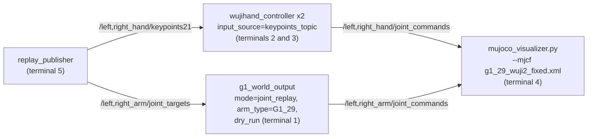

# Developer Usage Reference

Daily commands for working on this repo. Assumes the one-time setup in
[Install](../README.md#install) is done: image built,
serials configured, container able to start.

Audience: a developer editing code. For first-time setup, use the
[main README](../README.md). For per-device operator setup (PICO,
trackers), see the [guides index](README.md).

- [Where commands run](#where-commands-run): host vs. container.
- [Container lifecycle](#container-lifecycle): start, enter, stop, destroy, logs.
- [Build and test](#build-and-test): colcon and pytest inside the container.
- [Launch](#launch): Monitor GUI, raw launch files, sim modes.
- [SOT bundle replay (sim)](#sot-bundle-replay-sim): replaying a recorded sample in MuJoCo.
- [Hardware replay](#hardware-replay): pointer to the operator runbook, [replay.md](replay.md).
- [Verify](#verify): the topic rates that prove the pipeline is up.
- [Which change needs which rebuild](#which-change-needs-which-rebuild): edit-to-action map.

## Where commands run

`docker compose` commands run **on the host**, from `docker/`. Everything else
(`colcon`, `ros2`, `pytest`) runs **inside** the `wuji-hand-teleop` container.
The host `src/` is bind-mounted into the container, so host edits are visible
inside immediately.

## Container lifecycle

Main `teleop` container:

```bash
cd docker
xhost +local:docker                     # once per host session, for Qt/MuJoCo GUIs
docker compose up -d                    # start (first start runs colcon build, ~2 min)
docker exec -it wuji-hand-teleop bash   # enter
docker compose stop                     # stop, preserves build artifacts
docker compose start                    # resume, no rebuild
docker compose down                     # destroy; next start re-runs colcon build
docker compose logs -f                  # tail logs, wait for "SDK Status:"
```

G1 arm container (separate image, profile-gated; address the service by name):

```bash
cd docker
docker compose build g1_world_output    # needs the unitree_sdk2_python submodule
docker compose up -d g1_world_output
```

> **`docker compose up -d g1_world_output` assumes a real G1 is reachable over
> DDS.** Its default command runs `g1_world_output.launch.py` with no
> `dry_run`, and the service has `restart: unless-stopped` — with no robot (or
> DDS sim bridge) answering on the domain, the node throws `TimeoutError: ...
> No rt/lowstate after 30s` and compose just restarts it, forever, every ~30s.
> For sim/no-hardware testing, don't use bare `up -d`; run with `dry_run:=true`
> instead (see [Simulation](../README.md#simulation)):
> ```bash
> docker compose run -d --rm --name g1-world-output g1_world_output \
>     ros2 launch g1_world_output g1_world_output.launch.py dry_run:=true
> ```

## Build and test

Inside the container:

```bash
# Rebuild ROS2 packages after code changes
colcon build --symlink-install

# Run one package's tests via colcon
colcon test --packages-select <package_name>
colcon test-result --verbose

# Or run pytest directly, e.g.:
python3 -m pytest src/controller/test/
python3 -m pytest src/output_devices/g1_world_output/tests/
```

## Launch

The Monitor GUI is the preferred entry point; raw launch files are the CLI
fallback. Preset-to-launch-file mapping is documented in
[Monitor GUI](../README.md#monitor-gui).

```bash
# One-click GUI (two presets: hand-only, and hand + PICO input)
ros2 run wuji_teleop_monitor monitor

# Hand-only, CLI
ros2 launch wuji_teleop_bringup wuji_teleop_hand.launch.py

# PICO arm input + hands, CLI
ros2 launch wuji_teleop_bringup pico_teleop.launch.py
```

> **Neither the GUI nor these launch files start the G1 arms.**
> `g1_world_output` runs in its own container (Pinocchio + CasADi need NumPy
> 1.x, the rest of the stack needs 2.x), so it cannot be a node in a
> `teleop`-container launch file. Start it from the host, in a second
> terminal:
>
> ```bash
> cd docker && docker compose run --rm g1_world_output \
>     ros2 launch g1_world_output g1_world_output.launch.py
> ```
>
> The two containers share host networking, `ROS_DOMAIN_ID`, and
> `docker/cyclonedds.xml`, so the arm target-pose topics cross between them.
> This end-to-end PICO -> G1 path has **not been verified on hardware yet**.

Sim modes (no physical robot):

```bash
# Hands: real glove input, no physical Wuji Hand (skips the hand driver)
ros2 launch wuji_teleop_bringup wuji_teleop_hand.launch.py enable_hand_driver:=false
python3 src/output_devices/g1_world_output/scripts/mujoco_visualizer.py --focus hands

# G1 arms: real IK, no DDS/hardware (run from docker/ on the host)
docker compose run --rm g1_world_output \
    ros2 launch g1_world_output g1_world_output.launch.py dry_run:=true
```

Full sim walkthrough, including the synthetic sweep that needs no hardware at
all: [Simulation](../README.md#simulation).

## SOT bundle replay (sim)

Replays one `RobotSTAR_demos/` sample through the production
output controllers, mirrored in MuJoCo on the 29-DoF model. No input hardware,
no robot. Four processes.

The five terminals below form this graph. Each box shows the mode parameter
that selects its replay branch; the modes are node parameters, not separate
processes ([architecture](architecture.md#sot-bundle-replay)):



```bash
# terminal 1 — G1 node in joint-replay mode (host, from docker/).
# arm_type G1_29 = the bundle's native 7-DoF-arm joint names (also the
# launch default). dry_run:=true is what keeps this sim-only — without it
# the node opens real DDS. control_rate 250 Hz interpolates the 50 FPS
# reference.
docker compose run --rm --name g1-world-output g1_world_output \
    ros2 launch g1_world_output g1_world_output.launch.py \
    dry_run:=true mode:=joint_replay arm_type:=G1_29 control_rate:=250.0

# terminal 2 + 3 — hand controllers on the keypoints topic (teleop container).
# wujihand_ik_replay.yaml is tracked in the repo (input_source: keypoints_topic)
ros2 run controller wujihand_controller --side left \
    -c src/output_devices/wujihand_output/config/wujihand_ik_replay.yaml
ros2 run controller wujihand_controller --side right \
    -c src/output_devices/wujihand_output/config/wujihand_ik_replay.yaml

# terminal 4 — viewer on the 29-DoF model (teleop container)
python3 src/output_devices/g1_world_output/scripts/mujoco_visualizer.py \
    --mjcf src/g1_wuji2_description/g1_29_wuji2_fixed.xml

# terminal 5 — the replay source (teleop container). --loop to repeat.
ros2 run replay replay_publisher -- \
    --method-dir RobotSTAR_demos/samples/<sample>/GT --loop
```

The bundle is bind-mounted read-only into the teleop container at
`/home/wuji/ros2_ws/RobotSTAR_demos` (docker-compose.yml), so the
relative path above works from the container's default workdir. A container
created before that mount was added needs `docker compose up -d teleop` to
recreate it (then rebuild the workspace inside — the build lives in the
container). Pick the first sample from the batch audits, not by eye: the
bundle flags at least one sample as failing its deployment audit. Never feed
`legacy_wuji_sim_only/hand_targets.csv` anywhere — hand joints are regenerated
live from the 21-point keypoints (that is the entire point of the
`keypoints_topic` path).

## Hardware replay

Operator runbook: [replay.md](replay.md). It covers preparing a clip
offline, checking the G1 and both hand connections, single-device replays
(left arm, right arm, left hand, right hand), and the full run, in as few
terminals as the two-container layout allows. Design and build status:
[spec/spec1.md](spec/spec1.md).

## Verify

```bash
ros2 topic hz /left_hand/joint_commands    # teleop: ~120 Hz; replay: ~45-50 Hz
ros2 topic hz /right_hand/joint_commands
```

The Wuji Glove connects in-process via `wuji_sdk` UDP, so there is no glove
topic to check; these two command topics are the observable output of the hand
pipeline.

Replay adds the arm side:

```bash
ros2 topic hz /left_arm/joint_commands     # ~250 Hz (interpolated), named joints
ros2 topic echo /left_arm/joint_commands --once   # 7 names under arm_type G1_29
```

## Which change needs which rebuild

<details>
<summary><b>Edit-to-action map</b></summary>

| You changed | Required action |
|---|---|
| Python code, launch files, existing YAML | Nothing beyond the initial `colcon build --symlink-install`; edits are live via the bind-mount and symlinks. Restart the running node to pick them up. |
| New files, new packages, or a new `.yaml.template` | `colcon build --symlink-install` inside the container, so `install/share/` symlinks pick them up |
| `docker/Dockerfile` or anything in `docker/prebuilt/` | `cd docker && docker compose build` on the host |
| `src/unitree_sdk2_python` pointer (and `src/wujihandros2` while the USB hand driver is still in the tree) | `git submodule update --init --recursive` on the host, then `colcon build --symlink-install` inside |
| `src/wuji-retargeting` pointer | `git submodule update --init --recursive`, then **`cd docker && docker compose build`** on the host. It carries a `COLCON_IGNORE`, so colcon never builds it: the container imports the copy pip-installed into the image at image-build time. `colcon build` alone silently leaves the old retargeting code running. |

Config files are tracked as `.yaml.template` only; `docker/entrypoint.sh`
seeds the real gitignored `.yaml` on first container start. Details:
[Configure serial numbers](../README.md#configure-serial-numbers).

</details>
